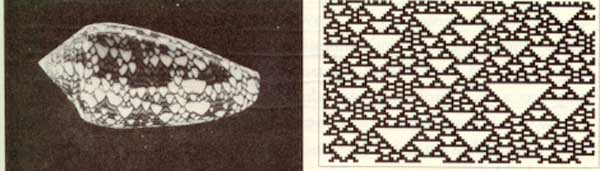
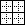

title: Artificial Life tutorial

---

# Artificial Life tutorial

**Artificial life** (often abbreviated ALife or A-Life) is a field of study and an associated art form which examine systems related to life, its processes, and its evolution, through the use of simulations with computer models, robotics, and biochemistry. Artificial life was named by Christopher Langton in 1986, but it can trace examples from the dawn of computing. The earliest computer scientists and cyberneticians (Turing, von Neumann, Wiener, Ashby) investigated artificial approaches to biological phenomena. In a sense, it also reformulates an age-old motivation to create life from artifice, such as the Golem, early automatons, and *anima*tion. 

A major hypothesis is that **life is not a property of the specific matter we know, but rather a more general property of particular organizations and behaviors**. Computing pioneer John von Neumann claimed that "life is a process which can be abstracted away from any particular medium". If so, there is no reason to suppose that life cannot occur in systems that are not part of our natural evolution, including digital media. Artificial life can be broadly categorized according to the media used:

- Soft: digital simulation
- Hard: physical robotic
- Wet: biochemical manipuation

In contrast to more traditional science, which focuses on particular systems to capture their principal parameters, the core strategy in Artificial Life is to investigate the principles of life through simulation. This involves finding simple rules that can generate complex behaviors, in a **bottom-up** approach. (At the birth of Artificial Life this was a sharp departure from top-down symbolic AI, but today this is no longer a reliable distinction.) 

> **Bio-inspired computing** is the use of computers to model the living phenomena, and simultaneously the study of life to improve the usage of computers... It takes a decentralised approach: bio-inspired techniques often involve the method of specifying a set of simple rules, a set of simple organisms which adhere to those rules, and a method of iteratively applying those rules. After several generations of rule application it is usually the case that some forms of complex behaviour arise.  *[wikipedia](http://en.wikipedia.org/wiki/Bio-inspired_computing)*

Due to this methodology, Artificial life research can also be categorized according to principal motivations and modes of evaluation ([Exteberria, "Artificial Evolution and Lifelike Creativity"](http://www.mitpressjournals.org/doi/abs/10.1162/002409402760105271)):

- **Scientific models**: as analytical tools to propose and evaluate theories with respect to actual life phenomena,
- **Engineering/design tools**: a problem solving-strategy evaluated according to fit, efficiency, accuracy etc.,
- **New ontologies and instantiations**: evaluated for other criteria involving 'lifelikeness'; including generative arts (**"life as it could be"**).

It has been significant for philosophy: "Artificial life’s computational methodology is a direct and natural extension of philosophy’s traditional methodology of a priori thought experiment." [Bedau, M. Open Problems in Artifical Life](http://authors.library.caltech.edu/13564/1/BEDal00.pdf)

From the earliest papers in the Artificial Life conference proceedings and journals, examples of all three perspectives are present, along with acknowledgement of the difficult philosophical questions, and example projects demonstrating remarkable capacity for adaptation and emergent complexity despite their inherent simplicity.

## Notable contributions

- Cellular automata among the oldest contributions, still widely used today. Read: [Wolfram](http://www.stephenwolfram.com/publications/articles/ca/).
- Evolutionary algorithms (genetic algorithm, evoluationary programming, swarm intelligence, ant colony optimization, ...): wide applicability in engineering/design optimization. Read: Holland, Koza. 
- Artificial chemistry: abstract chemical reactions to simulate the emergence of life. Read: Fontana.
- Agent-based systems: from scientific modeling to ubiquitous computing and robotics. 
- L-systems, rewriting systems and developmental modeling have been heavily used in computer graphics. Read: Lindenmeyer, Prusinkiewicz.

[Sims, K. Evolved Virtual Creatures](http://www.karlsims.com/papers/siggraph94.pdf), [video](https://www.youtube.com/watch?v=JBgG_VSP7f8), and [3DEVC examples](https://www.youtube.com/user/kjlg74?feature=watch)

[L-Systems (skip to 11:45)](https://www.youtube.com/watch?v=fjNPUtwURpc)

## Controversy

Artificial Life is not without controversy. Although it aims to dispel earlier _vitalism_, it remains deeply enmeshed in the controversies regarding _emergence_ and _complexity_ (see "from complexity to perplexity" (Horgan)), with similar challenges as AI and the study of consciousness. As a science it has been accused of being "fact-free" (Maynard Smith), yet its research has been published in *Science* and *Nature*. 

The question of artificial nature touches the nerve of creativity; an enticing opportunity for generative and algorithmic arts. Art/culture critic Edward Shanken suggests that ALife is grounded in theory and ideas more than in life itself. Simon Penny, N. Katharine Hayles and Rodney Brooks criticized both AI and ALife for being 'disembodied', priveling mind over body; though more contemporary ALife now involves greater interaction, immersion, robotics and biochemistry. 

The position of life as property of organization has been characterized as **strong ALife**. The **weak ALife** position on the other hand allows that we can simulate life in order to understand the mechanisms of real living entities, but we cannot actually synthesize life itself. In any case, to define a simulation as 'alive' depends on having a widely agreed upon definition of 'life' itself, which remains problematic. 

Soft ALife has also been frequently related to issues of computer security and viruses, and hard/wet ALife with cyborg and biological disaster, and warfare.

We have found that life isn't always what we think it is: evolution is not necessarily progressive, nor gradual, survival is not often a question of fitness, large amounts of DNA are shared between incredibly different species, environmental nurture is essential to development, etc. Can we understand more deeply by creating autonomous life-like systems?

Life is the best example we have of systems adapting to unpredictable environments while propagating complexity; of surpassing themselves. What we learn may inform adaptive, responsive (responsible? sustainable?) designs for present-day concerns: biotech, ubicomp, cloud & device, robotics... 

It may offer opportunities to raise new ethical issues. For example, the post-human / post-organic life discussions (see Hayles); away from 'essentialism' toward 'cyborg subjects' (Haraway). The future of *our* life is (and always has been) deeply connected with the future of machines.

[Artificial Life // a Primer. Simon Penny, 2009](http://simonpenny.net/texts/Resources/a_life.pdf)

[On Biologically Inspired Computation “a.k.a. The Field”. Jason Brownlee, 2005.](https://www.google.com/url?sa=t&rct=j&q=&esrc=s&source=web&cd=21&ved=0CC8QFjAAOBQ&url=http%3A%2F%2Fciteseerx.ist.psu.edu%2Fviewdoc%2Fdownload%3Fdoi%3D10.1.1.70.1101%26rep%3Drep1%26type%3Dpdf&ei=p-U3UZqBI43ckgWg2YCwAQ&usg=AFQjCNHDG_pHBeHBKPtfIZZvXu6HDeHlhw&bvm=bv.43287494,d.dGI)

## ALife Resources

### Journals: 

[Artificial Life](http://www.mitpressjournals.org/loi/artl), Evolutionary Computation, IEEE Transactions of Evolutionary Computation, Physica D (Nonlinear Phenomena), Adaptive Behavior, [Artificial Life and Robotics](http://www.springer.com/computer/ai/journal/10015), [IJALR](http://www.igi-global.com/journal/international-journal-artificial-life-research/1153)

### Conferences: 

ECAL, [EvoWorkshops](http://evostar.dei.uc.pt/2012/), IEEE ALIFE, IEEE CEC, GECCO, ALEA, EA

### See also:

[alife.org](http://alife.org/), [biota.org](http://biota.org), [FreshSim](http://www.freshsim.org/discussion/11/established-alife-projects), [Complexity Digest](http://comdig.unam.mx/)

# Cellular systems and lattice models

Provides an interesting continuum between non-living (such as molecules in crystal and metalline structures) and living (such as cells of a multi-cellular organism). The main difference is that, although both begin with more or less 'the same program', in living material the individual behavior of each cell specializes according to early conditions. This is important for *developmental biology*. Of course, computational cellular systems are far, far simpler than biological cells; but still draw from this inpsiration. The CA model was propsed by Stanislaw Ulam and used by von Neumann to demonstrate machines that can reproduce themselves; a more concise example being proposed by [Christopher Langton](http://www.youtube.com/watch?v=2iDc4C6vbcc) decades later, itself later [improved upon using artificial evolutionary techniques](http://www.youtube.com/watch?v=vbpoTZlNTiw&NR=1&feature=endscreen).

[The wikibooks on CA](http://www.interciencia.es/PDF/WikipediaBooks/CellAutomata.pdf).

The essential components that define a cellular system:

- **Cellular space:** A collection of cells arranged into a discrete lattice, such as a 2D grid. 
- **Cell states:** The information representing the current condition of a cell. In *Game of Life* this is either 0 or 1, but in other systems the state could be represented by an n-tuple of values, or something more complex. The set of possible states could be defined as finite or unbounded.
- **Initial conditions:** What state the cells are in at the start of the simulation.
- **Neighborhood:** The set of adjacent/nearby cells that can directly influence a particular cell. In *Game of Life* these are the 8 side and corner neighbors (the *Moore* neighborhood). In other systems it could be expressed as a radius or range.
- **State transition function:** The rule that a cell follows to update its state, which depends on the current state and the state of the neighborhood.
- **Time axis:** The cells are generally updated in a discrete fashion, which may be synchronous (all cells update simultaneously) or asynchronous (cells update separately, e.g. in a probabilistic manner).
- **Boundary conditions:** What happens to cells at the edges. A periodic boundary 'wraps around' to the opposite edge; a static boundary always has the same state, a copying or reflective boundary mirrors the neighbor state, etc.

## Cellular automata

The mathematical notion of *automaton* indicates a discrete-time system with finite set of possible states, a finite number of inputs, a finite number of outputs, and a transition rule which gives the state at the next step in terms of the state and inputs at the previous step.

A *CA* applies this notion to a cellular space. It has discrete time, finite neighborhood (inputs), finite state set (often represented as integers) and synchronous update. The transition rule (or CA rule) is usually deterministic, giving a cell state[t+1] as a function of the states[t] of itself and neighbours; and all cells use the same transition rule. 

The space itself is usually 1D, 2D or 3D, but rarely greater. Wolfram performed most of his research using 1D CAs, such as the 'rule 30' CA below, whose evolution bears similarities with some shell patterns. The most famous CA *Game of Life* is 2D, which is so popular that people have written [Turing machines](http://www.youtube.com/watch?v=My8AsV7bA94) and [Game of Life](http://www.youtube.com/watch?v=xP5-iIeKXE8) in terms of it. [Over here a 3D cellular automaton is taking over Minecraft](https://www.youtube.com/watch?v=wNypW-aSCmE), and [here is a self-replicating computer in 3D](http://www.youtube.com/watch?v=PBXO_6Jn1fs).



Wolfram divided CA into four classes, according to their long-term behavior:

- **Class 1** - stable. Evolves to homogeneous state.
- **Class 2** - cyclic. Evolves to simple separated periodic structures. Local changes to the initial pattern tend to remain local
- **Class 3** - chaotic. Any stable structures that appear are quickly destroyed by the surrounding noise. Local changes to the initial pattern tend to spread indefinitely
- **Class 4** - complex. Local changes to the initial pattern may spread indefinitely. Wolfram has conjectured that many, if not all class 4 cellular automata are capable of universal computation.

### Conway's Game of Life

The *Game of Life* CA is an example of a *outer totalistic* CA: The spatial directions of cells do not matter, only the total value of all neighbors is used, along with the current value of teh cell itself. The transition rule for a cell can be stated concisely as follows:

- If the current state is 1 ("alive"):
	- If the neighbor total is less than 2: New state is 0 ("death by loneliness")
	- Else if the neighbor total is greater than 3: New state is 0 ("death by overcrowding")
	- Else: State remains the same ("alive")
- If the current state is 0 ("dead"):
	- If the neigbor total is exactly 3: New state is 1 ("reproduction")
	- Else: State remains the same ("dead")

The Game of Life produces easily recognizable higher-level formations including stable objects, oscillatory objects, mobile objects and objects that produce or consume others, for example, which have been called 'ponds', 'gliders', 'eaters', 'glider guns' and so on. In Wolfram's terms, it is *Class 4* CA.

Note that these rules mean that the Game of Life is not reversible: from a given state it is not possible to determine the previous state.

### Implementation

If the cells are densely packed into a regular lattice structure, such as a 2D grid, they can efficiently be represented as *array* memory blocks. The state of a cell can be represented by a number, so an array of integers works well. A way to index this array memory to read or write a cell coordinate will be useful.

In theory the transition rule can be represented as a *look-up table*, however above a certain number of states and neighbors the size of this table would become astronomical (k states raised to the power of k neighbor states raised to the power of n neighbors; for a 3-state, 3-neighbor system this requires 7 billon rules!), so a procedural implementation is preferable. CAs may use bit-wise operators to implement the transition rules in a hardware-optimized way, but we will use regular ```if``` statements, like the above, for clarity. 

One complication is that the states of the whole lattice must update synchronously. That means: when one cell changes, all cells should change. This is not easy to achieve in most computing systems today, which mostly follow instructions one at a time (with only limited parallelism). A naive implementation will thus update cells one at a time, and the neighborhood of a particular cell will contain both 'past' and 'future' states. One way to work around this is to maintain two copies of the lattice; one for the 'past' states, and one for the 'future' states. The transition rule always reads from the 'past' lattice, and always writes to the 'future' lattice. After all cells are updated, either the 'future' is copied to the 'past', or the 'future' and 'past' lattices are swapped, since the future of yesterday is the past of tomorrow. 

> This technique is called *double-buffering*, and is widely used in software systems where a parallel process interacts with a serial machine. It is used to render graphics to the screen, for example.

Here is the [Game of Life](http://codepen.io/anon/pen/QbmEvG/right/?editors=001) in our online code editor. And here is a similar CA using 3 states: [Brian's Brain](http://codepen.io/anon/pen/EjENaK/right/?editors=001)

## Variations

### Non-homogenous CA

The rule is not the same for all cells / for all time steps. Spatial non-homogeneity can be interesting to simulate different geographies (such as boundaries). Temporal non-homogeneity can be used to perform a sequence of different filters.

- Special *boundary* cells in the field may follow different rules from others.
- Some rules may depend on the cell position; perhaps the same CA has different regions using different rules.
- The rules used could alternate between different rule definitions, over a period of N frames. Or certain parameters to rules could cycle over certain periods.
- The neighborhood selection rules could change spatially or temporally as above (also see particle CA below).
- Variations of space/rule/neighborhood could depend on global conditions, such as the overall density of black and white cells, or due to user interactions.
- Combinations of the above.

These can be implemented by changing the function used in the transition rule, or by extending the state set to accommodate the differences. Changing the function is usually easier to implement and understand.

### Probabilistic/Stochastic CA

In this case the transition rule is not deterministic, but includes some random factor. 

- A probability can be assigned to each successor state according to the prior states. 
- A *backround noise* can be added, such that from time to time a randomly chosen cell changes state. A *temperature* control could control the statistical frequency of such changes.
- Combinations with non-homogenous CAs: statistical choice of rules and neighborhoods; variations of probabilities over space and time, etc.

Take a look at the [Forest Fire](http://codepen.io/anon/pen/LVdbEW/right/?editors=001), and try changing the probabilities to see how it behaves.

### Particle CA, Lattice-Gas Automata and Block Rule CA

The cell states represent the presence (or absence) of particles in a cell, and transition rules represent how particles move across cells. Generally the transition rule must preserve the quantity of particles. The elementary 1D traffic CA (rule 184) is a simple particle CA. 

An implementation option is to use *block rules*, which consider small regions at a time, rather than individual cells; e.g. a 2x2 region of cells in a 2D CA (the *Margolus neighborhood*). To handle the boundaries between blocks, the regions are shifted between each application ([see wikipedia](http://en.wikipedia.org/wiki/Block_cellular_automaton)). 



Note that a block rule CA does not need to be implemented with two buffers, since each block updates synchronously internally, and independently externally.

More example block CAs [here](http://psoup.math.wisc.edu/mcell/rullex_marg.html) // many of these are implemented in the example code: [Block Rules](http://codepen.io/anon/pen/MwVbag/right/?editors=001). 

In 1969, German computer pioneer (and painter) Konrad Zuse published his book [Calculating Space](ftp://ftp.idsia.ch/pub/juergen/zuserechnenderraum.pdf), proposing that the physical laws of the universe are discrete by nature, and that the entire universe is the output of a deterministic computation on a single cellular automaton. This became the foundation of the field of study called *digital physics*. Zuse's first model is a 3D particle CA.


Particle CA can use probabilistic rules to simulate brownian motions and other non-deterministic media (but the rules would usually still need to be matter/energy preserving). Particle CA benefit from the inclusion of boundaries and other spatial non-homogeneities such as influx and outflow of particles at opposite edges.

### Asynchronous CA

Instead of updating all cells at once, update one cell at a time, according to some update policy. The same choices can be applied per-block in a block-rule CA.

- A fixed update policy, such as linear scan or pre-determined path, is orderly, but may introduce artifacts (related to the *double-buffering* pattern). 
- A *probabilistic asynchronous CA* chooses the next active cell according to a random selection (related to the Monte Carlo methods described below).
- A multi-rate CA (self-clocked) updates each cell according to a clock period that varies from cell to cell. The clock period could also be affected by neighbors, to achieve *entrainment* effects.
- A *mobile CA* chooses a related cell (such as one of the neighbors) of the current active cell as the next active cell. So in addition to choosing a new state for the cell, the transition rule must also choose how to move the active cell. This could also be partly probabilistic.

There could be more than one 'active cell'. What happens if two active cells occupy the same site?

[Langton's Ant](http://en.wikipedia.org/wiki/Langton%27s_ant) is a mobile CA in a 2D, two-state space, with very simple rules:

- At a white square, turn 90° right, flip the color of the square, move forward one unit
- At a black square, turn 90° left, flip the color of the square, move forward one unit

[See Langton's Ant](http://codepen.io/anon/pen/MwVbwg/right/?editors=001), and the [original video by Christopher Langton](http://www.youtube.com/watch?v=w6XQQhCgq5c), including examples of multiple ants (and music by the Vasulkas). Note that Langton's Ant, and other related Turmites, are closely related to the turtle graphics often used for L-systems. [Here are Multiple Ants](http://codepen.io/anon/pen/oXqYXW/right/?editors=001).

#### Statistical and unbounded state models

The *Ising model* of ferromagnetism in statistical mechanics can also be simulated in a *Monte Carlo* fashion. Each site (cell) has either positive or negative spin (we can encode that as 0 or 1 value). At each time step, consider a site at random, and evaluate the probability of changing state. If changing state moves the site toward energetic equilibrium with neighbors (determined according to the Hamiltonian of the site), then the change is made. Otherwise, the change is made only with a small probability that is dependent on the energetic difference and overall temperature. Thus at high temperatures, the system remains noisy, while at low temperatures it gradually self-organizes into all sites with equal spin.

It is also related to the *contact process* model, which has been used to simulate the spread of infection: infected sites become healthy at a constant rate, while healthy sites become infected at a rate proportional to the number infected neighbor (see also the *HodgePodge* simulation). This can be extented to multiple states for a multitype contact process. The *voter model* similarly simulates the changing of opinion in social groups. 

Here is the amazing [Hodgepodge](http://codepen.io/anon/pen/qdoqOr/right/?editors=001) in our editor.

The cellular *Potts model* (also known as the *Glazier-Graner* model) generalizes these to allow more than two site states, and in some cases, an unbounded number of possible site states; however it still utilizes the notion of statistical movement toward neighbor equilibrium to drive change, though the definition of a local Hamiltonian. Variations have been used to model grain growth, foam, fluid flow, chemotaxis, biological cells, and even the developmental cycle of whole organisms. Note that in this field, the term *cell* is used not to refer to a site on the lattice, but to a whole group of connected sites that share the same state. So in modeling foam, a *cell* represents a single bubble, and is made of one or more *sites*. Most changes therefore happen at the boundaries between these cells.

Stan Marée used this model to simulate the whole life cycle of [Dictyostelium discoideum](http://www-binf.bio.uu.nl/stan/Thesis/).


### Continuous automata

**Continuous states:** In this case, the states are not discrete but belong to a continuum, such as the linear range 0..1. Instead of using a discrete transition rule or lookup table, continuous functions can be used (or combined with discrete rules such as numeric comparisons). Continuous automata can show liquid and diffusive effects.

**Continuous neighborhood:** Instead of accumulating whole neighbor cells, apply a *kernel* region. Perhaps give different weights to cells according to the degree that they fall under a radius, or by distance.

#### SmoothLife

[SmoothLife](http://www.youtube.com/playlist?list=PL69EDA11384365494) still uses a discrete grid, but both the kernel and transition functions are adjusted for smooth, continuous values. A disc around the cell is integrated and normalized (i.e. averaged) for the cell's state, and a ring around this is integrated & normalized (averaged) for the neighbor state. Cell transition functions are expressed in terms of continuous sigmoid thresholds over the [0, 1] range, and re-expressed in terms of differential functions (velocities of change) to approximate continuous time. [Paper here](http://arxiv.org/pdf/1111.1567v2.pdf). By doing so, it removes the discrete bias and leads to fascinating results. [Another implementaton](http://www.youtube.com/watch?v=l7t8LtdBAV8). [Taken to 3D](http://www.youtube.com/watch?v=zA857JdUn9o&list=PL69EDA11384365494&index=46). In effect, by making all components continuous, it is essentially a simulation of differential equations.

[Here is a great explanation of the SmoothLife implementation, with a jsfiddle demo](http://0fps.net/2012/11/19/conways-game-of-life-for-curved-surfaces-part-1/)

#### Reaction Diffusion

The reaction-diffusion model was proposed by Turing to describe embryo development and pattern-generation ([Turing, A. The Chemical Basic for Morphogenesis.](http://www.dna.caltech.edu/courses/cs191/paperscs191/turing.pdf)); it is still used today in CG ([Greg Turk's famous paper](http://www.cc.gatech.edu/~turk/my_papers/reaction_diffusion.pdf)). RD systems and other differential equation systems can be approximated using continuous automata.


One approach to simulating RD using CA is the *Gray-Scott* model, as described in [Pearson, J. E. Complex Patterns in a Simple System](http://arxiv.org/pdf/patt-sol/9304003.pdf). There is [a wonderful archive of this model at this webpage](http://mrob.com/pub/comp/xmorphia/), including many great video examples of the [u-skate world](http://www.youtube.com/watch?v=F5oKgVZ6bTk), and even [u-skate in 3D](http://www.youtube.com/watch?v=B03lcPEmSOQ). An implementation in our software can be found [here](https://github.com/grrrwaaa/gct753/blob/master/ca_2D_greyscott.lua).

Some of these systems share resemblance with analog video feedback ([example](http://www.youtube.com/watch?v=hDYEVv9t32U), [example](http://www.youtube.com/watch?v=Uw5onuS2_mw)), which has been exploited by earlier media artists (notably the Steiner and Woody Vasulka). 

### Multi-Scale Systems 

Several cellular systems can be coupled together at different scales. 

- Perhaps each cell of a macro-CA is itself an entire micro-CA world. Or several CA can overlap with different spatial relationships. 
- Different indexing rules (such as affine transformations of coordinate space) can be used to impart non-local symmetries and behavior.
- Different rules (or different neighborhood specifications) can be run in parallel on the same shared data. 
- Higher- and lower-level systems could progress at different rates (or statistical frequencies).

Artists Driessens & Verstappen created a recursive cellular system (exhibited in the artwork *IMA Traveller*) which appears to show an endless zoom; as the whole field appears to expand, each cell periodically subdivides into four daughter cells, following one of several rules to vary the color. Cells outside the viewpoint are thrown away. The effect is an infinitely expanding landscape or journey, which can be partially navigated by the gallery visitor. See the [website](http://notnot.home.xs4all.nl/ima/IMAtraveller.html) and in particular the [info](http://notnot.home.xs4all.nl/ima/IMAcat.html) link. This work has inspired discussion by several critics, including [Mitchell Whitelaw](http://www.tandfonline.com/doi/abs/10.1076/digc.14.1.43.8810) and [Jon McCormack and Alan Dorin](http://citeseerx.ist.psu.edu/viewdoc/download?doi=10.1.1.16.6640&rep=rep1&type=pdf&utm_source=twitterfeed&utm_medium=twitter).

#### Multi-Scale Symmetric Turing Patterns

[Jonathan McCabe's cyclic multi-scale Turing patterns](http://www.jonathanmccabe.com/), and a [commentary by Mitchell Whitelaw](http://teemingvoid.blogspot.kr/2007/02/jonathan-mccabe-very-cellular-automata.html). The implementation is described [in this paper](http://www.jonathanmccabe.com/Cyclic_Symmetric_Multi-Scale_Turing_Patterns.pdf).

It starts with a straightforward reaction/diffusion system:

- Diffusion is simulated by averaging the continuous cell values over small (activator) and large (inhibitor) radii; if the the smaller (activator) concentration is greater than the larger (inhibitor) concentration, increase the cell value by a small amount; otherwise decrease. 
- After running the rule over all cells, the entire field is *normalized* (to ensure the minimum cell value is zero and the maximum cell value is 1).

Since this creates structure at a single spatial scale, it can be elaborated by super-imposing several models at different spatial scales (different small and large radii). Or, by changing the radii dynamically over time (as in [Greg Turk's famous paper](http://www.cc.gatech.edu/~turk/my_papers/reaction_diffusion.pdf)). McCabe's system uses several pre-defined scales, but selects which scale to apply for a particular cell according to which one currently shows the least local variation. 

Additionally, his system does not measure all cells within a radius; instead it selects cells at the radius distance and certain angular directions, creating cyclical symmetries in the result. For example, 3-fold symmetry may be used at a smaller scale, and 9-fold symmetry at a larger scale.

# Multi-agent systems (agent-based models)

Some of the most beautiful, fascinating or strange phenomena of nature can be understood as emerging from the behaviors of interacting agents. Widely acknowledged examples include the flocking of birds (or swarming insects, schools of fish), and the societal 'superorganisms' of ant colonies. 


We have come to understand that despite the obvious organization that we see at the macro-scale, there is no hierarchical center of coordination, but rather the whole emerges from simple interactions at local levels. These have been suggested as examples of emergence, or of self-organization. Which is to say, the whole is greater than a naive sum of its parts. 


Agent-based models, or multi-agent systems, attempt to understand how non-trivial organized macro-behavior emerges from objects that interact primarily at a local-level. These objects are called **agents**. Besides modeling flocks and colonies, agent-based modeling has applications from microbiology to sociology, as well as video games and computer graphics. 

## What is an agent?

An autonomous agent interacts within an environment populated by other agents, but behaves independently without taking direct commands from other agents nor a global planner or leader. Agent-based models typically operate in parallel within a spatial environment, in which interactions are usually limited to local distances, rather like cellular automata. But unlike CA, which roots a program in a particular spatial location (the cell), an agent-based program is typically mobile. 

The agent abstraction has arisen somewhat independently in different fields, thus the definition of an agent can vary widely. The following components are usually present:

- **Properties**: Persistent but variable features of an agent, such as size, color, speed, direction, energy level, and so on. 
- **Input**: Limited capabilities of sensing (or receiving messages from) the environment
- **Output**: Limited capabilities of performing actions on (or sending messages to) the environment, or its own properties. Typically this includes the ability to move through space.
- **Processing**: An information processing capacity to select actions in response to inputs. This capacity may also include information storage (memory).
- **Motivations**: The agent may also incorporate explicit goals or purposes in the form of self-evaluation and self-adaptation; or these may be implict in the design of the processing algorithm.

As a biological approximation, an agent could refer to anything from individual proteins, viruses, cells, bacteria, organisms, or population groups. Agent systems also share similarities with particle systems.

Just like CA, at times, the self-organizing behavior of systems of even relatively simple agents can be unpredictable, complex, and generate new emergent structures of order. 

## Tortoises and Vehicles

In the 1950's, Cyberneticist Grey Walter pioneered the engineering of agents, as early examples of autonomous robots, with his *"tortoises"*. Remarkably, this direction of research was largely forgotten as efforts in artificial intelligence concentrated on symbolic thinking. (Brief history [here](http://www.rutherfordjournal.org/article020101.html)).

[ >> video](http://www.youtube.com/watch?v=lLULRlmXkKo)

Nevertheless, Walter's tortoises inspired the turtle graphics of Logo, the situated robotics of Rodney Brooks, the flocking behaviors of Craig Reynolds, and Valentino Braitenberg's Vehicles.

### Vehicles


> A Braitenberg vehicle is an agent that can autonomously move around. It has primitive sensors (measuring some stimulus at a point) and wheels (each driven by its own motor) that function as actuators or effectors. A sensor, in the simplest configuration, is directly connected to an effector, so that a sensed signal immediately produces a movement of the wheel. Depending on how sensors and wheels are connected, the vehicle exhibits different behaviors (which can be goal-oriented).  [wikipedia](http://en.wikipedia.org/wiki/Braitenberg_vehicle)

Cyberneticist Valentino Braitenberg argues that his extraordinarily simple mechanical vehicles manifest behaviors that appear identifiable as fear, aggression, love, foresight, and optimism. The vehicle idea was a thought experiment conceived to show that complex, apparently purposive behaviour did not need to depend on complex representations of the environment inside a creature or agents brain. In fact simply by reacting to the environment in a consistent manner was more than enough to explain the low level reactive behaviours exhibited by many animals.

> Braitenberg, V. (1984). Vehicles: Experiments in synthetic psychology. Cambridge, MA: MIT Press. 

Casey Reas (co-author of Processing), Yanni Loukissas, and many others have used populations of Braitenberg-inspired vehicles to create artworks based on their combined paths.


Vehicles have also been constructed in hardware of course // see examples [here](http://www.ini.uzh.ch/~conradt/research/BraitenbergVehicle/), [here](http://blog.electricbricks.com/en/2010/05/vehiculos-braitenberg-nxt-g/), [here](http://tinkerlog.com/2009/06/07/mini-braitenberg-vehicle/).

### Steering Behaviors

Craig Reynolds' work with robotics is strongly inspired by Braitenberg's and Walter's vehicles, and became famous for his work on simulating flocking behavior (see below). His work has been widely used in robotics, game design, special effects and simulation. Reynolds' paper [Steering Behaviors for Autonomous Characters](http://www.red3d.com/cwr/steer/gdc99/) breaks agent movement into three layers:

- **Action Selection**: selecting actions to perform according to environmental input and goals to achieve. 
- **Steering**: path determination according to the action selected. Many different behaviors can be used; the essential strategy is ```steering force = desired_velocity - current_velocity```.
- **Locomotion**: mechanisms of conversion of steering into actual movement.

The paper is well worth exploring as a collection of patterns for autonomous agent movements; and presents the elements that make up his simulation of flocking behavior.

### Random walks in nature

A **random walk** involves small random deviations to steering. This produces a **random walk** or **Brownian motion**, a form of movement that is widely utilized by nature. In Reynolds' paper it is the *wander* steering strategy.

### Boids, flocking, swarms

In the late 1980s Reynolds proposed a model of animal motion to model flocks, herds and schools, which he named *boids*. Each boid follows a set of rules based on simple principles:

- **Avoidance**: Move away from other boids that are too close (avoid collision)
- **Copy**: Fly in the same general direction as other nearby boids
- **Center**: Move toward the center of the flock (avoid exposure)

In addition, if none of the conditions above apply, i.e. the boid cannot perceive any others, it may move by random walk. 

To make this more realistic, we can consider that each boid can only perceive other boids within a certain distance and viewing angle. We should also restrict how quickly boids can change direction and speed (to account for momentum). Additionally, the avoidance rule may carry greater *weight* or take precedence over the other rules. Gary Flake also recommends adding an influence for *View*: to move laterally away from any boid blocking the view.

Evidently the *properties* of a boid (apart from location) include direction and speed. It could be assumed that viewing angle and range are shared by all boids, or these could also vary per individual. The *sensors* of a boid include an ability to detect the density of boids in different directions (to detect the center of the flock), as well as the average speed and direction of boids, within a viewable area. The *actions* of a boid principally are to alter the direction and speed of flight. 

#### Implementation

The behavior of an agent depends on the other agents that it can perceive (the *neighborhood*). The simplest way to detect nearby agents is to simply iterate all agents and apply a distance condition (being careful to exclude the agent itself!). We can also include a view angle condition (easily calculated using vector dot product).

```javascript
view_range = 0.1; 	// how far an agent can see

function agent_update_sensors(self) {
	// create a list of nearby agents:
	var neighbors = [];
	// test all agents:
	for (var i=0; i<agents.length; i++) {
		var near = agents[i];
		// don't compare with ourself!
		if (near != self) {		
			// near enough?
			var rel = near.location.subnew(self.location);
			if (rel.length() < view_range) {
				// is the neighbor in front of us?
				// (use dot product of my velocity to determine this)
				if (self.velocity.dot(rel) > 0) {
					// add this to the set of neighbors:
					neighbors.push(near);
				}
			}
		}
	}
	
	if (neighbors.length > 0) {
		// now calculate steering influence according to visible neighbors:
		// ...
	} else {
		// no visible neighbors, so we can explore freely...
		// ...
	}
}
```

> This isn't especially efficient, but for small populations it is quite reasonable.

Once a set of visible neighbors is calculated, it can be used to derive the steering influences of the agent. The center force depends on the average location of neighbors, relative to the agent. The copy force depends on the average velocity of neighbors. The avoidance force applies if a neighbor is too close.

> Note that since the agents are dependent on each other, it also makes sense to perform movements and information processing in separate steps. Otherwise, the order in which the agent list is iterated may cause unwanted side-effects on the behavior. (This multi-pass approach is similar in motivation to the double buffering required in many cellular automata).

See the example of [Flocking Boids](http://codepen.io/anon/pen/gpeLaK?/right/editors=001) in the editor.

----

## Environmental interaction

### Chemotaxis

When we look at microbiology, we find even simpler modes of steering behavior.

> Chemotaxis is the phenomenon whereby somatic cells, bacteria, and other single-cell or multicellular organisms direct their movements according to certain chemicals in their environment. This is important for bacteria to find food (for example, glucose) by swimming towards the highest concentration of food molecules, or to flee from poisons (for example, phenol). In multicellular organisms, chemotaxis is critical to early development (e.g. movement of sperm towards the egg during fertilization) and subsequent phases of development (e.g. migration of neurons or lymphocytes) as well as in normal function. [wikipedia](https://en.wikipedia.org/wiki/Chemotaxis)

A [video example of chemotaxis in E. coli](http://www.youtube.com/watch?v=ZV5CfOkV6ek).

E. coli can use its flagella to move in just two modes (*locomotion*): 

- Move forward more or less straight
- Tumble about randomly

The *goal* is to find the highest sugar concentration. It can sense the local sugar concentration at its current location. However it cannot sense at a distance, and has no sense of direction, never mind which direction is best. 

Instead it uses chemical memory to detect sugar concentration *gradient*, that is, the differential of concentration at the current location compared to how it was just a few moments ago. This gradient tells the E. coli whether things are getting better or worse, which can be used to select between the swimming or tumbling patterns. 

With just a few tuning parameters, this can lead to a very rapid success in finding the higher concentrations of sugar (assuming the environment is smoothly varying). 

#### Implementation

The first thing we need is an environment of varying sugar concentrations for the agents to explore. We can use the ```field2D``` module for this purpose. The behavior of the agents will depend on the spatial distribution of sugar in the field; a totally random space is both unrealistic and will defeat chemotactic strategies; a smoothly distributed landscape is needed. For example, we can use the distance from the center:

```javascript
var dim = 128;
var sugar = new field2D(dim, dim);
var center = new vec2(0.5, 0.5);

sugar.set(function(x, y) {
	// convert x, y in to 0..1 range:
	var p = new vec2(x / dim, y / dim);
	// get distance from center:
	var d = p.copy().sub(center).length();
	// make concentration higher at center, lower with increasing distance:
	return 1 - d;
})
```

Agents can then sample the local field during their update routine as follows:

```javascript
	// in agent_update:
	var sugar_concentration = sugar.sample(self.location.x, self.location.y)
```

Here's an implementation of [Chemotaxis](http://codepen.io/anon/pen/pJLNgM/right/?editors=001) in the editor.

A variety of other *taxes* worth exploring can be found on the [wikipedia page](http://en.wikipedia.org/wiki/Taxis#Aerotaxis). Note how chemotaxis (and other taxes) can be divided into positive (attractive) and negative (repulsive) characters, just like forces (directly seen in steering forces). This is closely related to the concepts of positive and negative feedback and the explorations of cybernetics.

### Stigmergy

*Stigmergy* is a mechanism of indirect coordination between agents by leaving traces in the environment as a mode of stimulating future action by agents in the same location. For example, ants (and some other social insects) lay down a trace of pheromones when returning to the nest while carrying food. Future ants are attracted to follow these trails, increasing the likelihood of encountering food. This environmental marking constitutes a shared external memory (without needing a map). However if the food source is exhausted, the pheromone trails will gradually fade away, leading to new foraging behavior. 

Traces evidently lead to self-reinforcement and self-organization: complex and seeminly intelligent structures without global planning or control. Since the term stigmergy focuses on self-reinforcing, task-oriented signaling, E. O. Wilson suggested a more general term *sematectonic communication* for environmental communication that is not necessarily task-oriented.

Stigmergy has become a key concept in the field of [swarm intelligence](http://en.wikipedia.org/wiki/Swarm_intelligence), and the method of *ant colony optimization* in particular. In ACO, the landscape is a parameter space (possibly much larger than two or three dimensions) in which populations of virtual agents leave pheromone trails to high-scoring solutions.

Related environmental communication strategies include social nest construction (e.g. termites) and territory marking.

#### Implementation

Being able to leave pheromones behind depends on the ability to write into as well as read from fields. This can be achieved using the ```splat``` method of the field:

```javascript
	// in agent update:
	pheromone_field.splat(intensity, self.location.x, self.location.y)
```

To store different pheromones we might want to use different fields. These fields should also probably decay over time (using the ```field.decay()``` method), and possibly diffuse slightly (using the ```field.diffuse()``` method).

To detect field intensites in different directions, we might want to sample with sensors further from the body center (similar to the sensors in the Vehicles model) and compare their results. 

---

## All the examples

- [Game of Life](http://codepen.io/anon/pen/QbmEvG/right/?editors=001)
- [Brian's Brain](http://codepen.io/anon/pen/EjENaK/right/?editors=001)
- [Forest Fire](http://codepen.io/anon/pen/LVdbEW/right/?editors=001)
- [Langton's Ant](http://codepen.io/anon/pen/MwVbwg/right/?editors=001)
	- [Multiple Ants](http://codepen.io/anon/pen/oXqYXW/right/?editors=001)
- [Hodgepodge](http://codepen.io/anon/pen/qdoqOr/right/?editors=001)
- [Block Rules](http://codepen.io/anon/pen/MwVbag/right/?editors=001)

- [Flocking Boids](http://codepen.io/anon/pen/gpeLaK?/right/editors=001)
- [Chemotaxis](http://codepen.io/anon/pen/pJLNgM/right/?editors=001)


