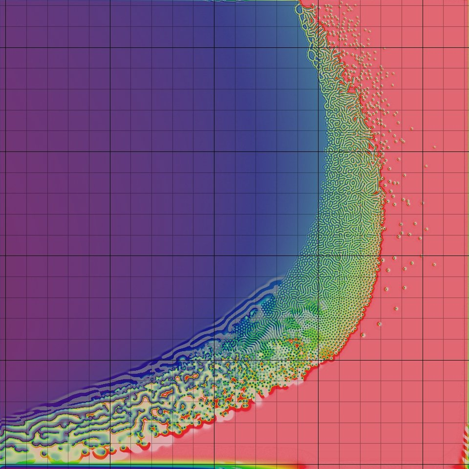

title: Cellular Systems
importance: 7

---

# Cellular automata (and related lattice models)

The mathematical notion of *automaton* indicates a discrete-time system with finite set of possible states, a finite number of inputs, a finite number of outputs, and a transition rule which gives the state at the next step in terms of the state and inputs at the previous step. 

A *Cellular Automaton* applies this notion in parallel to a cellular space, in which each cell of the space is a stateful automaton. The essential components that define a cellular system are:

- **Cellular space:** A collection of cells arranged into a discrete lattice, such as a 2D grid. The space is usually 1D, 2D or 3D, but rarely greater. 

- **Cell states:** The information representing the current condition of a cell. In binary CAs this is simply either 0 or 1.

- **Initial conditions:** What state the cells are in at the start of the simulation.

- **Neighborhood:** The set of adjacent/nearby cells that can directly influence the next state of a cell. The most common 2D neighborhoods are: 

- **State transition function:** The rule that a cell follows to update its state, which depends on the current state and the state of the neighborhood. It gives the cell state[t+1] as a function of the states[t] of itself and neighbours. 

- **Time axis:** The cells are generally updated in a discrete fashion, which may be synchronous (all cells update simultaneously) or asynchronous (cells update sequentially).

- **Boundary conditions:** What happens to cells at the edges of the space. A periodic boundary 'wraps around' to the opposite edge; a static boundary always has the same state, a reflective boundary mirrors the neighbor state.


The CA model was propsed by Stanislaw Ulam and used by [von Neumann](https://en.wikipedia.org/wiki/Von_Neumann_universal_constructor) -- in the 1940's -- to demonstrate machines that can reproduce themselves. Decades later Christopher Langton proposed a more concise [self-reproducing CA](http://www.youtube.com/watch?v=2iDc4C6vbcc), which has since been further improved upon using artificial evolutionary techniques:

<iframe width="480" height="360" src="https://www.youtube.com/embed/vbpoTZlNTiw?rel=0" frameborder="0" allowfullscreen></iframe>

CAs are not just for exploring this question. Christopher Adami describes CAs as the first "artificial chemistries", since they operate as a medium to research the continuum between the (such as molecules in crystal and metalline structures) and the living (such as cells of a multi-cellular organism). Thus they can be used to model all kinds of information processing and development in biological systems, as well as questions of life's origins. (However the computational cellular systems we will visit are far, far simpler than biological cells.)

Stephen Wolfram, author of Mathematica, performed extensive research on CAs and uncovered general classes of behaviour comparable to dynamical systems. A commonly referenced example is his 'rule 30', which is a 1D CA displayed below as a stacked trace (history goes down) -- whose pattern is reminiscent of some naturally occurring shell patterns:


<iframe width="480" height="360" src="https://www.youtube.com/embed/jDguxopxyJk?rel=0" frameborder="0" allowfullscreen></iframe>

[Here are some of the well-known 1D rules](http://codepen.io/grrrwaaa/pen/meVoMo?editors=001)

Wolfram divided CA into four classes, according to their long-term behavior:

- **Class 1** - stable. Evolves to homogeneous state.
- **Class 2** - cyclic. Evolves to simple separated periodic structures. Local changes to the initial pattern tend to remain local
- **Class 3** - chaotic. Any stable structures that appear are quickly destroyed by the surrounding noise. Local changes to the initial pattern tend to spread indefinitely
- **Class 4** - complex. Local changes to the initial pattern may spread indefinitely. Wolfram has conjectured that many, if not all class 4 cellular automata are capable of universal computation.

---

[Over here a 3D cellular automaton is taking over Minecraft](https://www.youtube.com/watch?v=wNypW-aSCmE), and [here is a self-replicating computer in 3D](http://www.youtube.com/watch?v=PBXO_6Jn1fs).

[The wikibooks on CA](http://www.interciencia.es/PDF/WikipediaBooks/CellAutomata.pdf).

---

### Conway's Game of Life

The most famous CA is probably the [*Game of Life*](http://codepen.io/grrrwaaa/pen/EVPGOB). It is a 2D, class 4 automata, which uses the Moore neighbourhood (8 neighbours), and synchronous update. The transition rule can be stated as follows:

- If the current state is 1 ("alive"):
	- If the neighbor total is less than 2: New state is 0 ("death by loneliness")
	- Else if the neighbor total is greater than 3: New state is 0 ("death by overcrowding")
	- Else: State remains the same ("alive")
- If the current state is 0 ("dead"):
	- If the neigbor total is exactly 3: New state is 1 ("reproduction")
	- Else: State remains the same ("dead")
	
> It is thus an example of a *outer totalistic* CA: The spatial directions of cells do not matter, only the total value of all neighbors is used, along with the current value of the cell itself. Note also that these rules mean that the Game of Life is not reversible: from a given state it is not possible to determine the previous state.

The Game of Life produces easily recognizable higher-level formations including stable objects, oscillatory objects, mobile objects and objects that produce or consume others, for example, which have been called 'ponds', 'gliders', 'eaters', 'glider guns' and so on. 

This CA is so popular that people have written [Turing machines](http://www.youtube.com/watch?v=My8AsV7bA94) and, recursively, the [Game of Life](http://www.youtube.com/watch?v=xP5-iIeKXE8) in it. 

### Implementation

If the cells are densely packed into a regular lattice structure, such as a 2D grid, they can efficiently be represented as *array* memory blocks. The state of a cell can be represented by a number, so an array of integers works well. A way to index this array memory to read or write a cell coordinate will be useful.

In theory the transition rule can be represented as a *look-up table*, however above a certain number of states and neighbors the size of this table would become astronomical (k states raised to the power of k neighbor states raised to the power of n neighbors; for a 3-state, 3-neighbor system this requires 7 billon rules!), so a procedural implementation is preferable. CAs may use bit-wise operators to implement the transition rules in a hardware-optimized way, but we will use regular ```if``` statements for clarity. 

One complication is that the states of the whole lattice must update synchronously. That means: when one cell changes, all cells should change. This is not easy to achieve in most computing systems today, which mostly follow instructions one at a time (with only limited parallelism). A naive implementation will thus update cells one at a time, and the neighborhood of a particular cell will contain both 'past' and 'future' states. One way to work around this is to maintain two copies of the lattice; one for the 'past' states, and one for the 'future' states. The transition rule always reads from the 'past' lattice, and always writes to the 'future' lattice. After all cells are updated, either the 'future' is copied to the 'past', or the 'future' and 'past' lattices are swapped, since the future of yesterday is the past of tomorrow. 

> This technique is called *double-buffering*, and is widely used in software systems where a parallel process interacts with a serial machine. It is used to render graphics to the screen, for example.

---

## Variations

There are many ways we can modulate this into more complex CA. For example, by allowing more than two states (see [Brian's Brain](http://codepen.io/grrrwaaa/pen/WQrmGb?editors=001)). 

More variations are possible by modulating the basic definition of a CA, some of which have been explored more than others. Here are some examples:


### Probabilistic/Stochastic CA

In this case the transition rule is not deterministic, but includes some randomized factors. This can help avoid the CA falling into a stable or cyclic pattern -- at the risk of descending into uninteresting noise.

- A probability can be assigned to each successor state according to the prior states. 
- A *backround noise* can be added, such that from time to time a randomly chosen cell changes state. A *temperature* control could control the statistical frequency of such changes.
- Combinations with non-homogenous CAs: statistical choice of rules and neighborhoods; variations of probabilities over space and time, etc.

Take a look at the [Forest Fire CA example](http://codepen.io/grrrwaaa/pen/xwZBRP/?editors=001), and try changing the probabilities to see how it behaves.

### Non-homogenous CA

The rule is not the same for all cells / for all time steps. Spatial non-homogeneity can be interesting to simulate different geographies (such as boundaries). Temporal non-homogeneity can be used to perform a sequence of different filters. Scott Draves' [Bomb](http://scottdraves.com/bomb.html) modulated parameters continuously, with different rule sets picking up the last as their new initial conditions.

- Special *boundary* cells in the field may follow different rules from others.
- Some rules may depend on the cell position; perhaps the same CA has different regions using different rules.
- The rules used could alternate between different rule definitions, over a period of N frames. Or certain parameters to rules could cycle over certain periods.
- The neighborhood selection rules could change spatially or temporally as above (also see particle CA below).
- Variations of space/rule/neighborhood could depend on global conditions, such as the overall density of black and white cells, or due to user interactions.
- Combinations of the above.

These can be implemented by changing the function used in the transition rule, or by extending the state set to accommodate the differences. Changing the function is usually easier to implement and understand.


### Particle CA and Lattice-Gas Automata

If the transition rule is careful to preserve a total cell values before and after, it can appear to model particles or fluids moving through space. The elementary 1D traffic CA (rule 184) is a simple particle CA. 

Particle CA can use probabilistic rules to simulate brownian motions and other non-deterministic media (but the rules would usually still need to be matter/energy preserving). Particle CA benefit from the inclusion of boundaries and other spatial non-homogeneities such as influx and outflow of particles at opposite edges.


> In 1969, German computer pioneer (and painter) Konrad Zuse published his book [Calculating Space](ftp://ftp.idsia.ch/pub/juergen/zuserechnenderraum.pdf), proposing that the physical laws of the universe are discrete by nature, and that the entire universe is the output of a deterministic computation on a single cellular automaton. This became the foundation of the field of study called *digital physics*. Zuse's first model is a 3D particle CA.

#### Block rule CA

One implementation option is to use *block rules*, which consider small regions at a time, rather than individual cells; e.g. a 2x2 region of cells in a 2D CA (the *Margolus neighborhood*). To handle the boundaries between blocks, the regions are shifted between each application ([see wikipedia](http://en.wikipedia.org/wiki/Block_cellular_automaton)). 


Note that a block rule CA does not need to be double-buffered, since block updates do not overlap. 

More example block CAs [here](http://psoup.math.wisc.edu/mcell/rullex_marg.html) -- many of these are implemented [in the example script here](http://codepen.io/grrrwaaa/pen/NGxJpP?editors=001). 


### Asynchronous CA

Rather than updating all cells at once, some other policy of visiting cells to update is applied:

- A fixed update policy, such as linear scan or pre-determined path, is orderly, but may introduce artifacts (related to the *double-buffering* pattern). 
- A multi-rate CA (self-clocked) updates each cell according to a clock period that varies from cell to cell. The clock period could also be affected by neighbors, to achieve *entrainment* effects. 
- Mobile CA (see below)
- Probabilistic asynchrony (see below)

#### Mobile CA

A *mobile CA* has a notion of active cells. The transition rule is only applied to active cells, and must also specify a related cell (such as one of the neighbors) of the current active cell as the next active cell. This could also be partly probabilistic. There could be more than one 'active cell' -- there could even be a list of currently active cells. Non-active cells are then described as "quiescent". What happens if two active cells occupy the same site?

- [Langton's Ant](http://en.wikipedia.org/wiki/Langton%27s_ant) is a mobile CA in a 2D, two-state space, with very simple rules:
	- At a white square, turn 90° right, flip the color of the square, move forward one unit
	- At a black square, turn 90° left, flip the color of the square, move forward one unit
		
[See our JavaScript version](http://codepen.io/grrrwaaa/pen/RWrdoq?editors=001), and [a variation with multiple ants](http://codepen.io/grrrwaaa/pen/MaKxJb?editors=001)
		
<iframe width="640" height="360" src="https://www.youtube.com/embed/hy3LG6isnQA?rel=0" frameborder="0" allowfullscreen></iframe>

The [original video by Christopher Langton](http://www.youtube.com/watch?v=w6XQQhCgq5c), including examples of multiple ants (and music by the Vasulkas):

<iframe width="480" height="360" src="https://www.youtube.com/embed/w6XQQhCgq5c?rel=0" frameborder="0" allowfullscreen></iframe>

> Note that Langton's Ant, and other related Turmites, are closely related to the turtle graphics often used for L-systems, which will return to later in the course.

#### Probabilistic Asynchronous CA

Chooses the next active cell according to a random selection.

The *Ising model* of ferromagnetism in statistical mechanics can be simulated in a *Monte Carlo* fashion: Each site (cell) has either positive or negative spin (we can encode that as 0 or 1 value). At each time step, consider a site at random, and evaluate the probability of changing state. If changing state moves the site toward energetic equilibrium with its neighbors (determined according to the [Hamiltonian](https://en.wikipedia.org/wiki/Hamiltonian_(quantum_mechanics)) of the site), then the change is made. Otherwise, the change is made only with a small probability that is dependent on the energetic difference and overall temperature. Thus at high temperatures, the system remains noisy, while at low temperatures it gradually self-organizes into all sites with equal spin.

The [contact process](https://en.wikipedia.org/wiki/Contact_process_(mathematics)) model has been used to simulate the spread of infection (and changes of opinion in voting): infected sites become healthy at a constant rate, while healthy sites become infected at a rate proportional to the number infected neighbours (see also the [HodgePodge](http://codepen.io/grrrwaaa/pen/LpGaxm?editors=001) simulation). This can be extented to multiple states for a multitype contact process.

#### Large/unbounded/complex states

The cellular *Potts model* (also known as the *Glazier-Graner* model) generalizes probabilistic asynchronous CA to allow more than two site states, and in some cases, an unbounded number of possible site states; however it still utilizes the notion of statistical movement toward neighbor equilibrium to drive change, though the definition of a local Hamiltonian. Variations have been used to model grain growth, foam, fluid flow, chemotaxis, biological cells, and even the developmental cycle of whole organisms. 

> Note that in this subfield of research, the term *cell* is used not to refer to a site on the lattice, but to a whole group of connected sites that share the same state. So in modeling foam, a *cell* represents a single bubble, and is made of one or more *sites*. Most changes therefore happen at the boundaries between these cells.

Stan Marée used this model to simulate the whole life cycle of [Dictyostelium discoideum](http://www-binf.bio.uu.nl/stan/Thesis/)!

States need not be discrete integers -- in other systems the state could be represented by an n-tuple of values, or a recursive structure allowing unbounded complexity. 

### Continuous automata

**Continuous states:** In this case, the states are not discrete but belong to a continuum, such as the linear range 0..1. Instead of using a discrete transition rule or lookup table, continuous functions can be used (or combined with discrete rules such as numeric comparisons). Continuous automata can show liquid and diffusive effects.

**Continuous neighborhood:** Instead of accumulating whole neighbor cells, apply a *kernel* region, perhaps expressed as a radius, perhaps also giving different weights to cells according to the degree that they fall within an ideal distance.

<iframe width="640" height="360" src="https://www.youtube.com/embed/ISQChKRH4NI?list=PL69EDA11384365494" frameborder="0" allowfullscreen></iframe> 

[SmoothLife](http://www.youtube.com/playlist?list=PL69EDA11384365494) uses a discrete grid, but both the kernel and transition functions are adjusted for smooth, continuous values. A disc around the cell is integrated and normalized (i.e. averaged) for the cell's state, and a ring around this is integrated & normalized (averaged) for the neighbor state. Cell transition functions are expressed in terms of continuous sigmoid thresholds over the [0, 1] range, and re-expressed in terms of differential functions (velocities of change) to approximate continuous time. [Paper here](http://arxiv.org/pdf/1111.1567v2.pdf). By doing so, it removes the discrete bias and leads to fascinating results. [Another implementaton](http://www.youtube.com/watch?v=l7t8LtdBAV8). [Taken to 3D](http://www.youtube.com/watch?v=zA857JdUn9o&list=PL69EDA11384365494&index=46). In effect, by making all components continuous, it is essentially a simulation of differential equations. [Here is a great explanation of the SmoothLife implementation, with a jsfiddle demo](http://0fps.net/2012/11/19/conways-game-of-life-for-curved-surfaces-part-1/)

#### Reaction Diffusion

The reaction-diffusion model was proposed by Alan Turing to describe embryo development and pattern-generation ([Turing, A. The Chemical Basic for Morphogenesis.](http://www.dna.caltech.edu/courses/cs191/paperscs191/turing.pdf)); it is still used today in computer graphics ([Greg Turk's famous paper](http://www.cc.gatech.edu/~turk/my_papers/reaction_diffusion.pdf)). RD systems and other differential equation systems can be approximated using continuous automata.

<iframe width="480" height="360" src="https://www.youtube.com/embed/8dTmUr5qKvI?rel=0" frameborder="0" allowfullscreen></iframe>

One approach to simulating RD using CA is the *Gray-Scott* model, as described in [Pearson, J. E. Complex Patterns in a Simple System](http://arxiv.org/pdf/patt-sol/9304003.pdf). There is [a wonderful archive of this model at this webpage](http://mrob.com/pub/comp/xmorphia/), including many great video examples of the [u-skate world](http://www.youtube.com/watch?v=F5oKgVZ6bTk), and even [u-skate in 3D](http://www.youtube.com/watch?v=B03lcPEmSOQ). 



Some of these systems share resemblance with analog video feedback ([example](http://www.youtube.com/watch?v=hDYEVv9t32U), [example](http://www.youtube.com/watch?v=Uw5onuS2_mw)), which has been exploited by earlier media artists (notably the Steiner and Woody Vasulka). 

### Multi-Scale Systems 

Several cellular systems can be coupled together at different scales. 

- Perhaps each cell of a macro-CA is itself an entire micro-CA world. Or several CA can overlap with different spatial relationships. 
- Different indexing rules (such as affine transformations of coordinate space) can be used to impart non-local symmetries and behavior.
- Different rules (or different neighborhood specifications) can be run in parallel on the same shared data. 
- Higher- and lower-level systems could progress at different rates (or statistical frequencies).

#### Ima Traveller


Artists Driessens & Verstappen created a recursive cellular system (exhibited in the artwork *IMA Traveller*) which appears to show an endless zoom; as the whole field appears to expand, each cell periodically subdivides into four daughter cells, following one of several rules to vary the color. Cells outside the viewpoint are thrown away. The effect is an infinitely expanding landscape or journey, which can be partially navigated by the gallery visitor. See the [info](http://notnot.home.xs4all.nl/ima/IMAcat.html) link. 
[Driessens & Verstappen: Ima Traveller](http://notnot.home.xs4all.nl/ima/IMAtraveller.html)

Ima traveller (1996) is interactive computer software for exploring an infinite universe. It enables you to make a journey into a space that is being created in real time. This space develops in the direction you are moving into, so there is no end to it. You travel forward in a smooth motion, you can drift in all directions, but you can never go back to where you came from. You are zooming in on a surface of infinite size, never reaching any boundaries.

<iframe width="640" height="360" src="https://www.youtube.com/embed/Ueq7UyrzGK4?rel=0" frameborder="0" allowfullscreen></iframe>

This work has inspired discussion by several critics, including [Mitchell Whitelaw](http://www.tandfonline.com/doi/abs/10.1076/digc.14.1.43.8810) and [Jon McCormack and Alan Dorin](http://citeseerx.ist.psu.edu/viewdoc/download?doi=10.1.1.16.6640&rep=rep1&type=pdf&utm_source=twitterfeed&utm_medium=twitter).

#### Multi-Scale Symmetric Turing Patterns

<iframe src="https://player.vimeo.com/video/137778082" width="720" height="405" frameborder="0" webkitallowfullscreen mozallowfullscreen allowfullscreen></iframe>

[Jonathan McCabe's cyclic multi-scale Turing patterns](http://www.jonathanmccabe.com/), and a [commentary by Mitchell Whitelaw](http://teemingvoid.blogspot.kr/2007/02/jonathan-mccabe-very-cellular-automata.html). The implementation is described [in this paper](http://www.jonathanmccabe.com/Cyclic_Symmetric_Multi-Scale_Turing_Patterns.pdf).

It starts with a straightforward reaction-diffusion system:

- Diffusion is simulated by averaging the continuous cell values over small (activator) and large (inhibitor) radii; if the the smaller (activator) concentration is greater than the larger (inhibitor) concentration, increase the cell value by a small amount; otherwise decrease. 
- After running the rule over all cells, the entire field is *normalized* (to ensure the minimum cell value is zero and the maximum cell value is 1).

Since this creates structure at a single spatial scale, it can be elaborated by super-imposing several models at different spatial scales (different small and large radii). Or, by changing the radii dynamically over time (as in [Greg Turk's famous paper](http://www.cc.gatech.edu/~turk/my_papers/reaction_diffusion.pdf)). McCabe's system uses several pre-defined scales, but selects which scale to apply for a particular cell according to which one currently shows the least local variation. 

Additionally, his system does not measure all cells within a radius; instead it selects cells at the radius distance and certain angular directions, creating cyclical symmetries in the result. For example, 3-fold symmetry may be used at a smaller scale, and 9-fold symmetry at a larger scale.

<iframe width="640" height="360" src="https://www.youtube.com/embed/4Sz-iEdNFDc?rel=0" frameborder="0" allowfullscreen></iframe>
