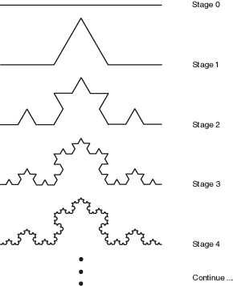

title: Rewriting Systems
importance: 6

---

# Rewriting systems, bytecode soups, and algorithmic chemistries

## Development and L-systems

<iframe src="https://player.vimeo.com/video/93056665" width="500" height="281" frameborder="0" webkitallowfullscreen mozallowfullscreen allowfullscreen></iframe>

The structure of a multi-cellular organisms develops in a gradual process from a single fertilized cell (the *zygote*) through progressive steps of cell duplication and specialization in a process called *development*; an active area of scientific research today. We know that each cell responds to chemical signals from its neighbors and other environmental conditions in order to know how to *differentiate* (to become a specific kind of cell in the body), according to the processes of the genome. The zygote does not contain a blueprint for the final organism, simply genotypic instructions for responding to environmental stimuli, which happen (in most cases) to produce the fully developed phenotype. 

A compact developmental representation can result in a more complex developed organism by relying on the self-organizing tendencies of the chemical substrate (such as the chemical pattern formation we saw with reaction-diffusion systems), the creative re-use of instructions (leading to the *modularity* and *symmetry* widely found in biology), and careful control over the ordering, when and for how long particular instructions operate (*heterochrony*). Development is clearly *parallel*, *decentralized*, granting some *robustness*, and yet it is also *context dependent*. It is also *self-limiting*, such that most developmental processes halt after the embryonic phase (though some may continue through the organism's lifetime, such as the *regeneration* of lost limbs).

In 1968 biologist Astrid Lindenmeyer proposed to model several aspects of developmental systems (cell division, cell differentiation and cell death) using rewriting systems on symbolic strings. The analogy is that each symbol represents a cell in a particular state, and the rules of transformation represent the processes of differentiating from one state to another, dividing into two cells, or of programmed cell death.

(Cellular automata can also be used to model developmental processes, and arguably langton's reproducing loop does so, but rewriting systems offer a very simple and abstract model that can support growth. Sims' evolving creatures used a substitution method closely equivalent rewriting to generate their body structures, for example.)


> Above is an example of a 3D-printed lampshade whose form is the product of a developmental simulation, by the [Nervous System design studio.](http://n-e-r-v-o-u-s.com)

## Rewriting systems

A rewriting system defines rules for the transformation of structures, typically strings of symbols. It is closely related to the formal notion of grammar. A system comprises:

- A set of possible symbols (A), called the *alphabet*
- An initial symbol (S), called the *axiom*
- A set (P) of *rewriting* or *production rules* to specify how each symbol is transformed to other symbols, at each production step. A rule converts a *predecessor* symbol into *successor* symbols.
- A process of applying these rules in parallel, step by step until no more productions can be applied.

For example:
- **alphabet**: ```{ "B", "F", "+", "-", "[", "]" }```, 
- **rules**: 
	- ```F -> FF``` 
	- ```B -> F[-B]+B```
- **start symbol**: ```B``` 

Then a sequence of productions could proceed as follows:

```
B						
// apply rule 1:
F[-B]+B					
// apply rule 1 (twice), and rule 2:
FF[-F[-B]+B]+F[-B]+B		
// apply rule 1 three times, rule 1 four times:
FFFF[-FF[-F[-B]+B]+F[-B]+B]+FF[-F[-B]+B]+F[-B]+B		
// etc.
```

Notice that any symbol that is not a predecessor of a production rule is passed through unchanged (it is not removed). 

### Turtle graphics

One of the simplest ways to use rewriting sytems for art and design is to interpret the produced strings as instructions for another program. The classic example is using them as instructions for a "turtle graphics" interpreter. 

For example, using the following system:

```javascript
	// just one rule: replace "F" with "F+F--F+F"
	rules["F"] = "F+F--F+F"
	// start with:
	S = "F"
```

If we interpret the "F" symbol to mean "move forward", and the "+" and "-" symbols to mean turn left and right by 60 degrees, then each successive application of this rule generates a successive iteration of the Koch curve fractal:



[See the Koch curve example in the lab editor](http://codepen.io/grrrwaaa/pen/xVVpea?editors=001).

### Bracketed systems

By adding push ```"["``` and pop ```"]"``` symbols to save/restore graphics state (position, orientation etc.), the graphics interpreter can render branched structures such as trees and ferns. The result is further improved by reducing the length of each line according to the bracketed recursion depth, and embellishing with more context-sensitivity:


[See the example Max/MSP/Jitter patch here](../code/lsystem_max.zip)

### Context-sensitive formal languages

An alphabet and production rules specify a formal language. In 1959 Noam Chomsky identified a hierarchy of four types of formal languages. They rest on the concept of *terminal* and *non-terminal* symbols, where a symbol is terminal if it cannot be further rewritten. Nonterminal symbols, which can be further rewritten, are normally indicated using upper case letters (A, B, C) and terminal symbols by lowercase letters (a, b, c). 

Each set in the hierarchy contains those above it:

1. **Regular (Type-3):** the predecessors of rules are a single nonterminal, the successors are a single terminal possibly followed by a single nonterminal, e.g. A -> Ab or A -> B.
2. **Context-free (Type-2):** the predecessors are a single nonterminal, and the sucessors can be any string of terminals and nonterminals. 
3. **Context-sensitive (Type-1):** the predecessors contain multiple symbols (including at least one nonterminal), and the sucessor is a copy with the nonterminal replaced by an arbitrary string of nonterminals. E.g. aBc -> aBbc, Ab -> aaab, abcD -> abcF, etc. They are therefore akin to Type-2 rules except with additional conditions regarding neighboring symbols (which remain unchanged).
4. **Unrestricted (Type-0):** predecessors and successors can both be any finite sequence of symbols without restriction.

So far we have considered only regular and context-free formal languages, since we have been restricted to single nonterminal symbols on the left-hand side (predecessors). Clearly, as a biological model (where the string is the phenotype and the production rules are genotype), our system should be context sensitive. Context would imply environmental conditions as well as neighbor cell signaling. 

In order to support context-sensitive languages, we will need more powerful pattern-matching capabilities, and need extra care to handle ambiguous situations. E.g. we must be careful to consider longer patterns before shorter ones, to ensure that e.g. ```aba``` matches a rule ```aba -> abba``` rather than the rule ```a -> b```. That is, our set of rules must now form a list (rather than a set), which is ordered by *priority*. And to match classes of structures, we may turn to using [regular expressions](https://developer.mozilla.org/en-US/docs/Web/JavaScript/Guide/Regular_Expressions) or more powerful [parsing expression grammars](https://en.wikipedia.org/wiki/Parsing_expression_grammar) as the pattern and pattern-matching features.

The lab toolkit includes the [peg.js](http://pegjs.org) library, available in the variable name "pegjs", which can be used to build parsers. This library also has an excellent [online editor](http://pegjs.org/online) in which you can design grammars and test them. I have a [parsing expression grammar tutorial designed for peg.js here](https://worldmaking.github.io/workshop_iclc_2016/tutorial.html).

### Parametric systems

A **parametric** L-system embeds parameters (such as line length and rotation angle) into the symbols, and sucessors may modify these parameter values. For example, the rule ```F(x) -> F(x*2)``` transforms a forward step into a forward step of twice the length.

A **conditional parametric** L-system extends this to incorporate conditions, such that the subsitution only occurs if the condition is true. For example, ```F(x : x < 10) -> F(x*2)``` transforms a forward step into a forward step of twice the length, only if the initial length was less than 10. 

In both cases, our pattern matching system now needs to be able to handle classes of symbols (or at least, ignore anything between parentheses). 

### Stochastic systems

So far our systems are deterministic, and will always reproduce the same results after a fixed number of steps. To create a more natural-looking result, we can introduce non-determinism:

- Into the interpreter (by adding small deviations to the turtle, for example). This will remove the stark repetition, but still preserves topological symmetry.
- Into the production rules. This can generate new topologies. 

A **stochastic** L-system does the latter: for a given non-terminal predecessor, there may be several successor strings which are selected at random (possibly according to weights). Or, if the rules are listed by priority, each rule can have a probablity of being ignored.

---

## Evo-Devo

L-Systems are difficult to predict and control: it is difficult to infer from an L-system definition and interpreter what the results will be, since (like cellular systems) the interactions are local but the consequences are global. Note that nature faces the same challenge: it cannot predict what changes to a genotype will result is viable or better phenotypes, and must proceed by trial and error (within the scope offered by development). Biologists exploring the mechanisms of development and generation of variation within it, and the relationship with evolutionary selection, work within the relatively new discipline of *evolutionary development* or "evo-devo". 

The role of development in the generation of variation is equally important for artificial evolution, however it has been less thoroughly explored. Two lessons from the biologists:

- Development is not just a compact representation of a phenotype, but can be crucial to the generation of complex systems.
- The recent discovery that widely different species re-use the same developmental genes and mechanisms. This perhaps suggests that finding a good set of re-usable mechanisms for long-term evolvability (continuous generation of selectable novelty) is not an easy task. 
- Development is not a one-way process, under command of the genome: factors in the environment can activate or inhibit parts of the genome (and parts of a genome can activate and inhibit other parts) in a complex *regulatory network*, and the state of the environment can affect the results of actions of the genome. In some cases the genome itself may not even be fixed. In part this environment is also inherited from an organisms' parents. 
- Development is ultimately working within the limits of a physical, chemical system, with entropic tendencies, self-organizing potential, noisy behavior, etc.

Artificial Evo-Devo systems could be categorized as follows:

- The developmental process is hand-written, and evolution only works on parameters for this system. This is amounts to a simple genotype-phenotype map. 
- Mechanims of development are encoded in the genotype, but in a fixed sequence (a fixed order with a fixed number of applications). This is suitable for evolving optimal L-systems for a given pattern, for example.
- The genotype encodes the sequence of applications of hand-written development mechanisms, as used for example in genetic programming.
- Both the basic mechanisms and the sequence of applications are encoded in the genotype and are therefore subject to evolution. Obviously the space of exploration is much larger and less predictable, but the challenge of finding suitable primitives and representations is difficult.

Whether it is parameters, sequence, mechanisms (or several) that are to be evolved, they must all be represented in the genome in forms that can be inherited, with additional mechanisms for generating variation (e.g. mutations). That is, each one of these elements must be represented symbolically as data (e.g. as strings, trees or matrices of symbols, which may be as low-level as binary form or as high-level as readable text). 

----

## Bytecode ecosystems

Perhaps the most abstract and deeply computational artificial life models are those in which the organisms *are* the code, serving as environments for each other. This approach plays most directly upon the fundamental insight that **code is data**. 

We generally assume that DNA also functions as both data and behaviour, but it has sometimes been overlooked that this is a *material process*. In bytecode soups, the code is not only data, it is the material on which code acts: fragments of code can react with each other, consume and produce each other, match or subvert each other, compete with each other for CPU time or memory resources, and thus evolve. These are the most digital of the artificial life organisms.


Since at least the early 1960's people have enjoyed creating virtual machines to explore the possibility of programs competing for control of the virtual machine processors and memory. The earliest example is the game Darwin, developed in 1961, in which programs competed to stop each other from executing. Later in *Core War*, another programming game in which programs (written in an abstract assembly language called "redcode") battle for control of a virtual computer, players discovered that rapid self-replication was a powerful strategy. (Virus and anti-virus systems have been modeled in these terms, although they also draw upon theories of immune systems and operate outside of protected environments.)

Steen Rasmussen took this idea and added genetic algorithms to evolve digital organisms in his *Coreworld* project; however complex evolution did not ensue, apparently because the assembly language was too brittle: mutations to code were far too likely to completely destroy a program. This problem of brittleness was overcome by the Tierra project.

## Thomas Ray's Tierra

"We can think of evolution as an artist..." - Tom Ray, The Tierra Video

- [The Tierra Video](http://life.ou.edu/Video/Tierra.html), or here on youtube:

<iframe width="480" height="360" src="https://www.youtube.com/embed/Wl5rRGVD0QI?rel=0" frameborder="0" allowfullscreen></iframe>

Tom Ray was an evolutionary biologist working in tropical rainforests for 20 years, but frustrated with the difficulty of studying evolution in the natural world, due to the restriction of using fossil records left over millions of years. So he decided to try exploring evolution in a computer, where it can operate much faster, and offer alternative models of life to study.

Although he didn't really know anything about how computers work, he decided to write very simple self-replicating organisms in machine language. But rather than real machine code, he created a byte code language for a virtual computer -- since he was afraid that with real machine code it might break out and infect the internet like a recent Worm virus). 

Nobody thought it would work, but remarkably, in his first ever run of the system, starting from a simple prototype organism, these organisms improved themselves multiple times, spawned parasites and hyperparasites, immune systems, symbiotic relationships, and more. Tierra found its way into Science, Scientific American, Economist, etc. It may have been the first Von Neuman computer designed for and showing evidence of evolvability.

> The Tierra C source code creates a virtual computer and its Darwinian operating system, whose architecture has been designed in such a way that the executable machine codes are evolvable. This means that the machine code can be mutated (by flipping bits at random) or recombined (by swapping segments of code between algorithms), and the resulting code remains functional enough. Along with the C source code which generates the virtual computer, we provide programs written in the assembler code of the virtual computer, written by a human, and which do nothing more than make copies of themselves in the RAM of the virtual computer. This system results in the production of synthetic organisms based on a computer metaphor of organic life in which CPU time is the ``energy'' resource and memory is the ``material'' resource. Memory is organized into informational patterns that exploit CPU time for self-replication. Mutation generates new forms, and evolution proceeds by natural selection as different genotypes compete for CPU time and memory space. [Adapted from "What Tierra Is"](http://life.ou.edu/tierra/whatis.html)

An organism is a program of code that occupies memory, and to be a viable organism this code must achieve self-replication, copying itself into another location in memory. One of the visualizations of Tierra represents the virtual memory visually as a sequence of bars, in which organisms are notated with specific colors.


> Each image represents a soup of 60,000 bytes, divided into 60 segments of 1000 bytes each. Each individual creature is represented by a colored bar, colors correspond to genome size (e.g., red = 80, yellow = 45, blue = 79). -- [As described here](http://life.ou.edu/pubs/images/)

The environment however is volatile: 
- From time to time bits or bytes are randomly modified as if hit by cosmic rays, causing mutations. 
- Moreover, once the memory is filled, a "reaper" process moves through the memory deleting programs that are old or defective (unable to run or replicate).

By this combination of a population, mutation, replication with heredity, and selection pressures of viability, the entire bytecode system creates artificial evolution.

### Darwinian OS components

Tierra inherits many ideas from Core War, including circular memory, small instruction sets, instruction-level time sharing, and prevention of external access. However in other regards it differs with biological goals.

Effectively, the virtual computer is an example of a virtual "chemical soup" with unique "algorithmic chemistry", in which organisms are both code and data.

- Soup (RAM): A fixed-size, circular ring, typically seeded with at least one functional organism.

- Organisms: Each organism is a virtual CPU, operating in a simulated parallel fashion via the Slicer. Each CPU has its own set of 4 registers and 10 stack slots for temporary calculations (attempts to use more slots will wrap around), as well as the current instruction pointer and stack pointer. 

- Slicer (timesharing/threading service): A circular queue of organisms (processes). It allocates CPU time to each process in the queue in succession. Each processes' time slice can be a fixed length, or a uniform random variate, determined by the genome length, etc. When a new organism is born it is added to the queue behind its mother.

- Reaper: A linear queue of organisms (processes). Processes enter the bottom of the queue at birth. If the memory is full, the Reaper kills processes at the top of the queue, removing them from both Reaper and Slicer. (A killed process could have its memory zeroed, randomized, or left as-is.) Older processes generally die first. When a process generates an error, it moves one position up the Reaper queue, while a successful birth of an offspring moves the process one position down.

- Memory allocator: An organism (process) is born with memory given to it by the parent. It may have read, write, or execute protection (the default is write protection only, such that other processes may not write to the block). A process may only spawn one offspring at a time, and may only reserve one memory block for each (an additional memory request before giving birth frees the offspring memory block without giving birth and allocates a new one, and instructions copied to the old block are not used). The memory allocator could be configured to locate available space by first fit, better fit, random preference, near mother's address, and suggested address. The allocator is connected to the Reaper: when a memory request cannot be fulfilled because a block of the requested size is not available, the Reaper kills processes until a block of the requested size becomes available. The size of memory requests are limited.

- Volatile conditions: 
	- sporadic mutations, e.g. randomly selected memory slot is randomized
	- mutations at birth
	- mutations while copying code
	- gene splicing at birth -- crossover, insertion, deletion, possibly at or not at template boundaries (see documentation for details)
	- flaws during execution, e.g. +1 or -1 error during addition
	- sporadic killing of organisms at random

Instruction set:

In designing his virtual computer and its machine code, Ray asked: why can you randomly alter DNA, but you can't randomly alter a computer program? So he designed his bytecode instruction set to make it more robust:

- Tierra originally had only 32 instructions (closer to the 20 amino-acid symbols of DNA than the much larger sets common in real PC architectures.) This makes random code  far more likely to be valid.
- Jump addresses described as templates, rather than fixed numbers (which would be likely to break under mutations). Template-matching is akin to the shape-matching used at microbiological levels. So, for example, the instruction sequence ```jmp nop0 nop0 nop1``` causes execution of the program to jump to the nearest occurrence of the instruction sequence ```nop1 nop1 nop0```. The complementarity (001 finds 110) ensures that the jump will not find a copy of itself.
- Apart from template-using instructions, all other instructions are atomic, requiring almost no syntax constraints. This also makes random code far more likely to be valid.
- No instruction can generate an error that would crash the virtual machine. Other errors are ignored (the instruction has no effect), but may reduce organism fitness (moving down the reaper list).

- pushA, pushB, pushC, pushD: copy register values onto stack
- popA, popB, popC, popD: remove & copy stack values onto registers
- movcd, movab: copy one register to another
- movii: copy from memory[A] to memory[B]
- subCAB, subAAC, incA, incB, decC, zero etc.: simple arithmetic
- not0, sh1: bit flip/shift
- ifz: skip next instruction if C is zero
- jmp, jmpb: jump to template (forward or backward)
- call: push instruction pointer onto stack then jump to template
- ret: jump to instruction according to stack value
- adrf, adrb: search (fwd/back) for template, put address & template size in register C
- mal: allocate memory of size C
- divide: create a child
- nop0, nop1: do nothing -- these serve only as labels for template matching

Ray's first ancestor organism looked like this:

```
nop1    ; 110 01   0 beginning marker
nop1    ; 110 01   1 beginning marker
nop1    ; 110 01   2 beginning marker
nop1    ; 110 01   3 beginning marker
zero    ; 110 04   4 put zero in cx
not0    ; 110 02   5 put 1 in first bit of cx
shl     ; 110 03   6 shift left cx (cx = 2)
shl     ; 110 03   7 shift left cx (cx = 4)
movDC   ; 110 18   8 move cx to dx (dx = 4)
adrb    ; 110 1c   9 get (backward) address of beginning marker -> ax
nop0    ; 100 00  10 complement to beginning marker
nop0    ; 100 00  11 complement to beginning marker
nop0    ; 100 00  12 complement to beginning marker
nop0    ; 100 00  13 complement to beginning marker
subAAC  ; 110 07  14 subtract cx from ax, result in ax
movBA   ; 110 19  15 move ax to bx, bx now contains start address of mother
adrf    ; 110 1d  16 get (forward) address of end marker -> ax
nop0    ; 100 00  17 complement to end marker
nop0    ; 100 00  18 complement to end marker
nop0    ; 100 00  19 complement to end marker
nop1    ; 100 01  20 complement to end marker
incA    ; 110 08  21 increment ax, to include dummy instruction at end
subCAB  ; 110 06  22 subtract bx from ax to get size, result in cx
nop1    ; 110 01  23 reproduction loop marker
nop1    ; 110 01  24 reproduction loop marker
nop0    ; 110 00  25 reproduction loop marker
nop1    ; 110 01  26 reproduction loop marker
mal     ; 110 1e  27 allocate space (cx) for daughter, address to ax
call    ; 110 16  28 call template below (copy procedure)
nop0    ; 100 00  29 copy procedure complement
nop0    ; 100 00  30 copy procedure complement
nop1    ; 100 01  31 copy procedure complement
nop1    ; 100 01  32 copy procedure complement
divide  ; 110 1f  33 create independent daughter cell
jmpo    ; 110 14  34 jump to template below (reproduction loop)
nop0    ; 100 00  35 reproduction loop complement
nop0    ; 100 00  36 reproduction loop complement
nop1    ; 100 01  37 reproduction loop complement
nop0    ; 100 00  38 reproduction loop complement
ifz     ; 000 05  39 dummy instruction to separate templates
nop1    ; 110 01  40 copy procedure template
nop1    ; 110 01  41 copy procedure template
nop0    ; 110 00  42 copy procedure template
nop0    ; 110 00  43 copy procedure template
pushA   ; 110 0c  44 push ax onto stack
pushB   ; 110 0d  45 push bx onto stack
pushC   ; 110 0e  46 push cx onto stack
nop1    ; 110 01  47 copy loop template
nop0    ; 110 00  48 copy loop template
nop1    ; 110 01  49 copy loop template
nop0    ; 110 00  50 copy loop template
movii   ; 110 1a  51 move contents of [bx] to [ax] (copy one instruction)
decC    ; 110 0a  52 decrement cx (size)
ifz     ; 110 05  53 if cx == 0 perform next instruction, otherwise skip it
jmpo    ; 110 14  54 jump to template below (copy procedure exit)
nop0    ; 110 00  55 copy procedure exit complement
nop1    ; 110 01  56 copy procedure exit complement
nop0    ; 110 00  57 copy procedure exit complement
nop0    ; 110 00  58 copy procedure exit complement
incA    ; 110 08  59 increment ax (address in daughter to copy to)
incB    ; 110 09  60 increment bx (address in mother to copy from)
jmpo    ; 110 14  61 bi-directional jump to template below (copy loop)
nop0    ; 100 00  62 copy loop complement
nop1    ; 100 01  63 copy loop complement
nop0    ; 100 00  64 copy loop complement
nop1    ; 100 01  65 copy loop complement
ifz     ; 000 05  66 this is a dummy instruction to separate templates
nop1    ; 110 01  67 copy procedure exit template
nop0    ; 110 00  68 copy procedure exit template
nop1    ; 110 01  69 copy procedure exit template
nop1    ; 110 01  70 copy procedure exit template
popC    ; 110 12  71 pop cx off stack (size)
popB    ; 110 11  72 pop bx off stack (start address of mother)
popA    ; 110 10  73 pop ax off stack (start address of daughter)
ret     ; 110 17  74 return from copy procedure
nop1    ; 100 01  75 end template
```

Visualization (ALMond):

> In addition, the operating system provides a very elaborate observational system that keeps a record of births and deaths, sequences the code of every creature, and maintains a genebank of successful genomes. The operating system also provides facilities for automating the ecological analysis, that is, for recording the kinds of interactions taking place between creatures. [Adapted from "What Tierra Is"](http://life.ou.edu/tierra/whatis.html)

### More information:

- [The Tierra homepage](http://life.ou.edu/tierra/)
- [Instructions on how to build the Tierra system on a Linux computer](http://tierra.lolwh.at)
- A direct descendent of Tierra, and one which has continued to have impact in artificial life research, is [Avida](https://en.wikipedia.org/wiki/Avida). 


---

## Artificial chemistries

One of the most enduring questions facing biology (and artificial life) regards how life itself emerged from non-life, and how that boundary continues to be bridged ("protobiology"). The emergence of life has not yet been observed in physical materials, however there are many hypotheses offered. In general the problem is how life-like behavior and organization emerges from simpler physical chemical systems; or at the very least, how new orders of structure emerge from simpler chemical models. Artificial chemistries (AC) are systems with similarities to models of physics and chemistry which can be used to explore these speculative models with more rigor.

AC's were proposed by John McCaskill, but probably the best known example ("AlChemy", described below) was created by Walter Fontana and Leo Buss, presented at the second Artificial Life conference. Hideaki Suzuki and Takashi Ikegami pursued the concept in Japan (with "systems of machines and tapes", referencing both Turing's and von Neumann's early work). [Banzhaf, Dittrich and Ziegler present an excellent review here](http://www.cs.mun.ca/~banzhaf/papers/alchemistry_review_MIT.pdf). See also [Artificial Chemistry. Hideaki Suzuki, Peter Dittrich. Artificial Life 2009, Vol. 15, No. 1.](http://www.mitpressjournals.org/doi/abs/10.1162/artl.2009.15.1.15100?journalCode=artl)

Like artificial life, in artificial chemistries the assumption holds that organization (information) is the most essential component. One of the central insights stems from a clear analogy between life and computation: organisms are created by organisms, just as programs can create programs. The ease of mapping of code and data mirrors a relationship between physical structure and behavior (form and function). 

Artificial chemistries are also one possible attractive option to overcome the 'over-specified' nature of most artificial evolutionary and / or developmental systems: a mechanism by which new features come into being, new behaviors, new sensors, new evolutionary pathways, even new modes of evolution. They have also been applied to optimization problems, and to the modeling of social systems. 

## Walter Fontana's Algorithmic Chemistry

Fontana's basic conjecture was that adaptive systems are characterized by self-referential processes, in which combinatorial objects encode functions that act back on those same objects. He addressed this by taking two inspirations from chemistry:

- the collision-reaction of two molecules can create a new molecule
- many different reactants can yield the same stable product

His insight was to treat fragments of code as equivalent to chemical molecules, and metaprogramming rewrites as equivalent to chemical reactions. That is, code that reacts by modifying itself. Fontana described his system as a "function gas" or "Turing gas", inspired by chemical flowmreactors, in that a large vessel of code fragments are agitated such that fragments randomly collide, and when they do, one is executed using the other as its input. That is, the code fragments are strings of executable code, that take other strings of code as input, and produce new strings of code as output.  And thus, programs are the material objects of the world.

> This is admittedly somewhat mind-boggling, and gets more so as his papers admit, however perhaps one way to get a grasp on it is to consider how we made an interpreter of a simple character language to generate graphical patterns as we created Biomorphs. Now imagine that rather than generating line segments, we are generating strings of code in the same character language. A crucial difference, which makes this more interesting, is that in Fontana's work it is not one string that is interpreted, but a pair of strings, where one is being inserted in the other during interpretation. You might observe that this is similar to what our *evolutionary* process of creating a new generation (rather than the *developmental* process of interpretation) achieved -- especially in the case of crossover recombination! However an important result of Fontana's work is that this evolutionary process emerges naturally from the chemistry itself, rather than being imposed from outside.

Importantly, **there is no control over the order of the chemical reactions** -- code fragments collide at random. The reaction process is thus:
- select one code fragment at random to execute (i.e. interpet as program)
- select another at random to pass in as the input argument (i.e. interpret as data)
- the result of the execution is another code fragment
- if this code fragment meets some minimal viability conditions (avoiding unreactive or trivial programs), it is added back into the soup, replacing some other randomly chosen code fragment (preserving total population size)

This total system showed a remarkable ability to quickly self-organize from populations of random functions to highly specific functions with cooperative characteristics, reliably increasing internal order and complexity. The system showed adaptability to perturbations, and led to a complex set of organizational architectures including catalytic loops, hypercycles, and self-replicating structures.

> "If syntactically legal strings of characters are combinatorial objects and if all legal strings define functions that transform legal strings into lega; strings, then we have an exceedingly simple instance of a combinatorial loop between objects and functions: an algorithmic chemistry, or AlChemy for short." [Walter Fontana. Algorithmic Chemistry: a model for functional self-organization. 1990](http://www.santafe.edu/media/workingpapers/90-011.pdf)

Fontana's "AlChemy" language was designed for:
- combinatorial, modular flexibility 
- lack of syntactic restrictions: that almost any randomly-produced combination of symbols is a legal program
- to be unable to cause errors or enter infinite loops

It is very simple, consisting of expressions that are either atoms or lists of expressions (including lists of lists of atoms, etc.) Atoms can be one of 11 pre-defined operators, or the symbol "a" to represent the current input variable. 

> This language is thus similar to LISP. LISP's simplicity makes it easy to manipulate through metaprogramming, and it is fairly unique in that data and programs look the same. It builds upon Alonzo Church's lambda-calculus, which is a functional formulation of computation yet still equivalent to the contemporaneous procedural Turing machine formulation.

Some example AlChemy molecules:

```
((-a)a(|(=aaa)a)(-a))
(aaa(%a))
(a(+(+a))(>a)(<a))
(a(%a)a('a))
(a(>(=(>a)(-a)(*aa)))('(=(*(<a)a)aa))(<(>(!aa))))
```
 
The pre-defined operators consume fixed numbers of arguments and return a value result. Other lists produce "functions", that are applied to the atom immediately to their right (the argument). That is, all the "a" symbols in the function are replaced by the argument, then the function is evaluated to produce its result. The value of a list is defined recursively in terms of the values of its elements. This continues until all elements of the list have been evaluated, typically leaving as a result another list.

Because functions are evaluated and then applied to subsequent arguments there is a high risk of infinite recursions of limitless depth. In AlChemy, expressions are only allowed to recurse to a maximum depth of 10 to prevent this possibility. A time limit was also applied to each interaction.

### Primitives

The "(" and ")" characters are used to identify lists. 

The "a" atom represents the input argument.

"'" this quote operator returns the argument without evaluating it

"%" returns the argument evaluated with the input being null (so long as the depth limit is not reached)

"+" return the first expression of a list (if input is an atom, just return the atom).

"-" return a list with the first expression deleted (if input is an atom, just return the atom).

">" and "<" are the inverse of "+" and "-"

"*" (2 arguments): if the second arg is a list, then return a copy of this list with the first argument inserted at its head. Otherwise just return the first argument.

"|" (2 arguments): the longer argument is shortened by the length of the shorter argument, and is then returned.

"=" (3 arguments): if first two arguments are identical strings, evaluate & return the third.

"/" (3 arguments): if the length of the first argument is odd, return the second, else the third argument.

---

## Further afield

Here is a [remarkable collection of browser-based demos](http://chorasimilarity.github.io/chemlambda-gui/dynamic/demos.html) of the ChemLambda system, which has strong influences from Fontana's work.

<iframe width="480" height="360" src="https://www.youtube.com/embed/6LZvIkM6JqY?rel=0" frameborder="0" allowfullscreen></iframe>

## General properties of artificial chemistries

A typical artificial chemistry includes:

- A set **S** of possible molecule types. This set could be finite or infinite (as far as we know, the set of possible molecules in the universe is infinite.) Molecules could be represented in the program as symbols, character strings, numbers, lambda-expressions, trees, etc.
- A set **R** of possible reaction rules, in which input combinations of input molecules produce combinations of output molecules; e.g. ```A + B -> 2C``` or ```A + 2B -> A + D```. Note that the second example is a *catalytic* reaction, since one of the inputs (```A```) is preserved unchanged. A reaction may also have other conditions, such as ambient temperature; and may have an associated probability ("rate constant") and energetic cost. 
- A population **P** of molecules (drawn from **S**) that exist at any moment. 
- An algorithm **A** specifying how to apply reactions to the population **P** and thus update to the population of the next instant (**P'**), following reaction rules as described below. A reaction may also have other conditions, such as ambient temperature; and may have an associated probability ("rate constant") and energetic cost. The reaction algorithm could take into account spatial proximity, or it could assume that all chemicals rapidly disperse (the "well-stirred reactor" model), in which reactions are selected stochastically. On the other hand, if concentrations of molecules are represented as continuous numbers, differential equations may be used. 

An important design choice is how to define the reaction rules. For a finite system these could be designed by hand (or to model a well-known physical system). For an infinite system they must be derived on demand; this could be done programatically according to reactant structures, in an approximation to molecule bonding mechanisms (or protein folding). For example, a simple demonstration AC uses integer division to define reactions: each molecule type is an integer (greater than one), and two molecules can react if they leave no remainder after division (the long-term behavior of this system tends to increase the concentration of prime numbers). Another possibility is to generate reactions and rates randomly as needed. 

The algorithm may also include a source and sink: the source is a continuous input of new (base) molecules, and a sink is a gradual removal of molecules to maintain population size. In addition, certain reactions may be filtered to make the whole system more interesting (e.g. discarding reactions that produce nothing more than one of their inputs).

> There are clearly similarities with rewriting systems (where the active population is the item being rewritten, made of molecule *terms* and reaction *productions*). There can also be similarities found with evolutionary, cellular and dynamical systems. Alternatively, AC's can be viewed as a special case of agent systems, in which each agent belongs to a molecule-class, and reactions are a result of agent interacitons (in which interactions usually lead to the creation and destruction of agents). 
