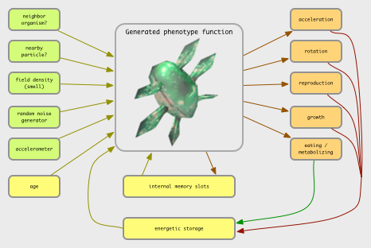
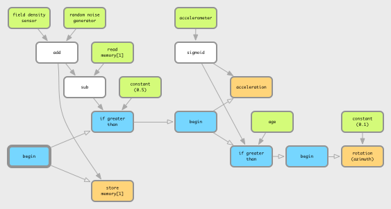

title: Evolutionary Systems
importance: 5

---

# Evolutionary Systems

There have been more than four decades of computational systems inspired by natural evolution. It has become a major field of machine learning and optimization. Beyond AI, it has been used in hardware and circuit design, robotics, and more recently in industrial design and architecture. It has of course also been deeply explored in art and music.


## Natural and artificial evolution

The theory of natural evolution combines **population, diversity, heredity and selection**. Evolution requires a **population** of individuals that exhibit **diversity** (both similarities and variations between each other, both within and between species). These individuals can produce new individuals; offspring that exhibit similarites with the parent(s) through **heredity**. However not all of the population can successfully reproduce. Any factor that affects the possibility of an individual reproducing, thus also affects what characteristics are inherited in the population as a whole. Charles Darwin's theory of natural **selection**, proposed in 1859, is that the section of the population that can reproduce is not entirely random, but rather is regulated by interactions between inherited characteristics and environmental constraints (such as available food, populations of symbionts, predators and parasites, and so on). Accordingly, the characteristics of a species may change over time (**evolution**), forming a history that can be investigated through the fossil records.


**Artificial evolution** is a form of computational simulation whose process mirrors the abstract structure of natural evolution:

- Maintain a population of finite individuals (which can reproduce)
- Support variation (including new characteristics) in the population
- Provide a mechanism of heredity between generations
- Provide a mechanism of selection 

The main systematic differences are that the underlying mechanisms specified by us in advance, as are the initial populations and environmental conditions (if any). Most importantly, *the mechanism of selection is usually predetermined*. And of course, artificial evolution occurs in a much simpler substrate than real chemistry.

[A fantastic list of practical applications of genetic algorithm & evolutionary programming](http://www.talkorigins.org/faqs/genalg/genalg.html#examples) 

### Some inspiration

[Karl Sims' Genetic Images](http://www.karlsims.com/genetic-images.html) -- and the [1991 Siggraph Paper](http://www.karlsims.com/papers/siggraph91.html)

[Karl Sims: Evolving 3D Morphology and Behavior by Competition, 1994](http://www.karlsims.com/evolved-virtual-creatures.html):

<iframe width="420" height="315" src="https://www.youtube.com/embed/JBgG_VSP7f8" frameborder="0" allowfullscreen></iframe>

[Scott Draves, “Evolution and Collective Intelligence of the Electric Sheep,” The Art of Artificial Evolution, 2008.](http://draves.org/aoae07/draves-aoae07.pdf)

<iframe src="https://player.vimeo.com/video/22469941" width="500" height="281" frameborder="0" webkitallowfullscreen mozallowfullscreen allowfullscreen></iframe>
<p><a href="https://vimeo.com/22469941">High Fidelity Sample</a> from <a href="https://vimeo.com/user4921556">Scott Draves</a> on <a href="https://vimeo.com">Vimeo</a>.</p>

[Evolving 2D cars](http://boxcar2d.com/)

[Evolving soft robots](https://www.youtube.com/watch?feature=player_embedded&v=z9ptOeByLA4)

Evolving neural networks to play Mario:

<iframe width="560" height="315" src="https://www.youtube.com/embed/S9Y_I9vY8Qw" frameborder="0" allowfullscreen></iframe>

An excellent discussion of [the genetic algorithm in art and its relation to Deleuze, by Manuel Delanda](http://www.youtube.com/watch?v=50-d_J0hKz0)

### Subtleties and misconceptions

Darwin's theory is sometimes misconceived as "survival of the fittest" or even the competitive "law of the jungle", but evolution turns out to be quite a bit more subtle than this.

- First, the *notion of "fittest" is misleading*. It implies a static and absolute measure against which all individuals and species in the biological record can be compared. In natural evolution there can be no pre-defined (*a priori*) fitness measure. This is because the environmental conditions are highly dynamic, and thus selective criteria are quite contextual. The conditions in which we live evolve along with us, and the other species in our habitat, as we mutually influence each other. Evolution is an open-ended process. 

- The complication of living in an ever-changing environment means that no one strategy can be universally superior. This is sometimes referred to as the "no free lunch" theorem, which is more accurately stated that "if an algorithm performs well on a certain class of problems then it necessarily pays for that with degraded performance on the set of all remaining problems." (Wolpert, D.H., Macready, W.G. (1997), "No Free Lunch Theorems for Optimization", IEEE Transactions on Evolutionary Computation 1, 67.)

- Since there is no absolute goal or progress, the most we can measure in natural evolution is the changing frequencies over time of individual species, or of individual characteristics of a population. More importantly, evolution cannot be said to have a singular direction. That is to say, it is goal-less (*non-teleological*), and thus, counter to common opinion, *natural evolution does not imply progress*. 

- Nor is evolution a continuous process of change. The fossil records appear to show long periods of relative stability divided by relatively brief periods of biological invention. There are several competing theories as to why, but interestingly this "*punctuated equilibrium*" has appeared also in many artificial evolutionary systems.

- An individual organism does not need to be optimally fit to the environment in order to contribute to the gene pool -- it simply needs to be *fit enough* to survive long enough to reproduce, i.e. to be *viable*. he survival of a natural species depends primarily on its *viability*; the ability of enough individuals to live long enough to reproduce within an unpredictable environment. 

- Evolution does not act on every facet of an organism, only those that directly influence viability (in the current environment). If a variation has neither positive or negative impact on the reproductive capability of an individual in the environment, this variation is called **neutral**. Since small variations are always occurring, neutral variations can tend to accumulate over time. Over time the gene pool may broaden and move quite far from its origin without causing any major changes in selective viability; this is called **neutral drift**.  This may be an important mechanism to escape evolutionary dead-ends (local minima in the fitness landscape). This is certainly true for many artificial evolutionary systems. It has also been hypothesized as an explanation for the long chunks of apparently unused DNA in our own genome, and also for punctuated equilibrium.

- Competition turns out not to be the prime mode of interaction between species; most species are relatively independent, and the ones that do closely interact are more likely to be collaborative (symbiotic, parasitic, etc.) than competitive, as that is more likely to lead to viability. Like our society, the natural environment is complex enough to provide multiple methods of making a living. Evolution does not imply that individuals display selfish, competitive behavior. When Dawkins described evolution in terms of [selfish genes](http://en.wikipedia.org/wiki/The_Selfish_Gene), it indicates a gene-centric perspective on evolution that implies selfless and sometimes altruistic behavior in organisms. Nevertheless, there is a sense in which competition applies, as with [red queen](http://en.wikipedia.org/wiki/Red_Queen_hypothesis) hypothesis: that organisms must constantly adapt, evolve, and proliferate not merely to gain advantage in reproductive viability, but also simply to survive while pitted against an ever-evolving context. However it is not clear whether a simple "arms race" is a sufficient perspective, or whether more complex and even abiotic factors may be more significant.

- Evolution by itself is not particularly creative, and its importance may have been over-stated. A continuous generation of novel diversity, new characteristics, is essential to the theory of natural selection. However the theory does not account for how diversity arises, simply that there must be a mechanism, which usually operates during reproduction. 

### Heredity and variation: genetics

In 1865 Mendel proposed that characteristics are transmitted to offspring through particles of matter (which we now call **genetic material**). Schroedinger conjectured that these materials must be aperiodic crystals, and the actual structure of DNA was identified several years later. The *"modern synthesis"* in biology today has integrated genetics with natural evolution, through the interaction of genotypes and phenotypes:

- The **phenotype** is the manifestation of the genotype, the individual organism in the population. It is physical and dynamic. Natural selection only operates on the phenotypic level.
- The **genotype** is the genetic material that is transmitted during reproduction. It encodes information that is usually static during a lifetime. Different information leads to different phenotypic variations, or even different species. Heritable variation and the creation of new characteristics operates only at the genotypic level. 

Hence the modern synthesis requires not only a model for how variation is introduced, but also how genetic material is transfered, how the phenotype accordingly emerges from the genotype (*developmental models*), and what other roles it plays. It is increasingly being understood how the complexity of the environment and materials of life are likely as much or more responsible for the variety of life than the genes themselves, however, these mechanisms are still in the progress of being revealed.

> Briefly: a biological cell contains a vast array of different proteins, whose concentrations determine structures and behaviors of the cell. The proteins are specifed by information in the DNA genetic material (grouped physically into **chromosomes**). When a cell reproduces by **mitosis**, a copy of the DNA is made in the new cell. The sections of a DNA chromosome that code for behavior are called **genes**. These regions are constantly being **transcribed**, producing a specific RNA strand for each coding gene region which is in turn used to produce a specific protein; the protein string immediately folds up (in a way we cannot yet simulate) into a particular reactive shape which specifies the protein's behavioral role in the cell. This is a one-directional flow of information: Coding DNA -> RNA -> folding -> active protein. In addition to coding regions genes may also have  **regulatory region** which can react with specific proteins to activate or inhibit the coding-protein system, forming a complex **regulatory network** of interactions by which one gene can activate or inhibit another, and also specify changes of behavior of a cell according to environmental conditions such as chemical signals. These networks can be fantastically complex even in very simple organisms, according to the scientific results of **functional genomics**. Between the coding and regulatory regions of DNA, there are huge sections of **nongenic** DNA, whose role (or lack thereof) is not yet understood.


[The current theory of cell replication and DNA transcription been beautifully illustrated by Drew Berry](http://www.youtube.com/watch?v=WFCvkkDSfIU); and [more of his animations here](http://www.youtube.com/watch?v=yKW4F0Nu-UY&list=PL3DB3C131CBCD2A0F&index=5)

Genetic variation can occur during replication of the genome, such as copying-error *mutations* (reversals of segments, insertion & removal of segments, changing individual elements in the sequence, and pair-wise substitution over whole sections) and *recombination* (taking sections from two different parent genes to construct a new child gene). 

## Artificial evolution

An artificial evolutionary system thus requires:

1. A representation of genotypes.
2. A mechanism to produce phenotypes from genotypes (development).
3. Mechanisms to introduce diversity to a genotype.
4. A mechanism to evaluate the fitness (or viability) of phenotypes.

These components must be provided by the author. The system is then run by these steps:

1. **Initialization** of a 'seed' population of genotypes
2. **Development** of phenotypes from the genotypes 
3. Evaluation and **selection** of best/viable candidates of phenotypes, according to fitness criteria or ongong viability conditions, to choose who may reproduce.
4. **Reproduction**, creating new genotypes by applying mechanisms of variation, according to variation rates/probabilities.
5. Repeat from step (2) or terminate if a terminating condition is satisfied (such as sufficient fitness). 

Steps 2-5 may be run in lock-step, or asynchronously with overlapping individual life-spans.

### Genetic representation

Many systems represent genetic information as a sequence of data, such as a string of characters or binary digits. Some systems use more elaborate structures (trees, networks), but these are usually reducible to and encoded as  linear sequences. After all, our genes wind up in complex structures with different reactive regions, but at the lowest level are just a long singular chain of A, G, C or T molecules.

The simplest systems have a fixed length, but nature shows quite a lot of variance (not particularly correlated with the size, complexity, or evolutionary age of a species). 

Initializing the genotypes implies generating randomized candidates that stay within its bounds but hopefully give a sufficiently diverse range of the possibilities of the genotype. For a simple sequence of bits, symbols, or numbers, this is fairly easy to do.

### Development

In some systems the developmental process is little more than a trivial mapping, but this potentially misses an entire and fascinating source of diversity. Incorporating more complex developmental models can lead to geometric variations that are not stored as simple parameters, to repeated segments and recursive structures, to symmetries, and to the re-application of common toolboxes toward a widely differing set of purposes -- all things that are evident in biological evolution. 

### Selection

**For problem solving in data mining, engineering, design, architecture, etc.**: If the fitness criterion is static and designed around a particular problem we wish to find a solution for, evolution can help evaluate & test candidate solutions and selectively breed them to produce better solutions, ideally converging on an optimal one, without having to understand or derive by proof. It is a form of optimization. However this process may take a long time or a lot of processing power to find a satisfactory result, or may not reach a result at all. Not all problems are suitable for evolutionary search.

Evidently, these systems differ markedly from natural evolution by having a static measure, and thus a singular teleological character, a meaningful sense of progress, across the entire history of the system. This is more akin to *selective breeding* than natural evolution. 

Note that simply taking the best candidate alone is not necessarily the ideal strategy; selecting randomly by proportion to fitness ("roulette wheel" selection) may better overcome local maxima.

**For art, music, and other less formalized domains** we may need to consider other methods of selection, since a formal measure may not be possible, or the problem may not be clearly statable in advance. E.g. can we measure aesthetic quality in formal terms?

- Interactive selection. Pioneered by Dawkins' Biomorphs program and Karl Sims' evolved images, in which several candidates are presented to human observers, who apply the selection manually. Also known as aesthetic selection. A problem here is that the human becomes the bottleneck of evolution, constraining population sizes and rates of evolution to very small scales. It may arguably also tend toward selecting for the aesthetic average rather than the remarkable.
	- An interesting variation is to make the selection continuous and implicit. Jon McCormack's Eden measured fitness globally according to how long gallery visitors remained in front of a particular evolving sub-population.
- Evolved/evolving selection. First evolve a population of artificial art critics, trained from human-evaluated examples, and then use these to apply selection criteria to a population of candidate artworks. Some projects have also proposed a form where one population represents the candidate products, and the other population represents artificial critics.
- A viability-oriented form of artificial evolution may be used for more theoretical and aesthetic branches of artificial life research. The viability measure arises as an emergent property of underlying laws of the world, such as the requirement to maintain energetic/metabolic balance or to maintain structural integrity, as well as the collective effects of multiple species and non-living dynamics within the environment. For this reason it is sometimes referred to as *ecosystemic selection*. [See discussion here](http://link.springer.com/chapter/10.1007%2F978-3-540-78761-7_42). This may still incorporate indirect interaction from human agents if desired.

### Variation

The mechanisms of variation possible partly depend on the representation chosen. The two most common principles of variation in artificial evolution are naturally inspired:

- Random **mutation**; akin to errors copying DNA. If the genome is represented as a binary string, then random locations in the string may be replaced by new random characters. For example, a parent "dog" could produce children such as "fog", "dqg", and so on. Obviously some mutations will not create viable individuals.
- Sexual **cross-over**: akin to sexual reproduction in biology. As a binary string, the child takes the first fraction from one parent, and the remainder from the other. For example, breeding the strings "dog" and "cat" could generate children such as "dot", "dat", "cag" and "cog". 
- Other forms of fragment **recombination**, such as insertion, deletion, reversal. So a more flexible system might also permit "doat", "caog", "dt", "tac", etc. 

> Why use reproduction for evolution? In the face of an unpredictable environment, we cannot know which strategy will be best; we can try small variations, and hedge our bets by making very many of them (population diversity). An individual loss is not catastrophic, but a few successes can be learned from. Furthermore, the face of unpredictibility implies that what was true today may not be tomorrow, so the flexibility to avoid timeless commitment is also a good strategy; but the inheritance of choices is a useful option when the environment retains some stability. If the world were fully predictable, a rational, teleological, monothematic strategy would be preferable. But the world isn't totally random either (if it was, there would be no valid strategy worth pursuing.) 

As with temperature-like parameters we saw in CA, a crucial factor in evolution is the rate or probability of variation. Too much, and the population may never significantly diverge from a randomly initialized one; too little, and it may find itself stuck on the first solution it finds, with a largely homogenous population. It may be wise to have different mutation rates for different genes, or for different members of a population, or by fitness rank etc. It is likely desirable to gradually reduce mutation rates over time, unless the population appears to be stagnating. (See also simulated annealing.)

----

## A trivial string generator

Just to practice the mechanics, we can start by evolving sentences toward a desired result. Each gene is an integer, which is mapped to a word from a predefined list:

```javascript
// the desired result:
var target = "the quick brown fox jumped over the lazy dog";

// the set of components:
var dictionary = ["I", "a", "an", "bleep", "blown", "bog", "box", "broad", "brown", "bumped", 
	"cat", "cog", "coloured", "colourful", "colourless", "crazy", "creep", "crown", "dig", 
	"do", "dog", "door", "dot", "ever", "fit", "fix", "flick", "for", "fox", "frown", 
	"glean", "great", "greed", "green", "greet", "hazy", "he", "hog", "ideas", "idols", 
	"in", "it", "jumble", "jumped", "jumper", "jumps", "last", "lazy", "leaped", "lumped", 
	"maze", "of", "offer", "ogre", "older", "on", "or", "over", "quick", "quite", "rapid", 
	"she", "sheen", "sheep", "sick", "sleep", "slept", "slow", "spelt", "spilt", "the", 
	"town", "under"];

// initial:
var geno = [];
for (var i=0; i < 9; i++) {
	geno[i] = random(dictionary.length);
}
// develop:
var pheno = [];
for (var i=0; i < geno.length; i++) {
	pheno[i] = dictionary[ geno[i] ];
}
pheno = pheno.join(" ");
```

To evaluate, we could compare how many of the right characters are in the right places:

```javascript
var err = 0;
for (var i=0; i < pheno.length; i++) {
	if (pheno.substr(i, 1) != target.substr(i, 1)) {
		err++;
	}
}
// make it fair between long & short strings:
err /= pheno.length;
```

To convert this error into a fitness, where fittest is 1 and least fit is zero, we could apply a ```1/(1+n)``` mapping:

```javascript
var fitness = 1 / (1 + err);
```

This gives us all the basic components we need to generate a random population as genotypes. We already know how to develop and evaluate such a genotype, and storing several in a population is trivial. 

It is generally useful to sort a population by fitness, which can be done like so:

```javascript
// sort the population by comparing pairs
// as a result, the fittest candidate will be in population[0]
population.sort(function(a, b) { return b.fitness - a.fitness; });
```

> After sorting it is convenient to print out the candidates, their fitness, etc, so we can see how the evolution proceeds.

After evaluating, we create a new generation of candidates, broadly derived from the previous, but with fitter candidates being more likely to be progenitors. The simplest method is to pick a parent at random, but biasing toward the lower indices. (A simple trick to do this is for the nth child to use a the parent at index ```random(n)```.)

> This is called *stochastic universal sampling*: it draws samples from the entire range, but selects fitter individuals more often than less-fit candidates.

We must also introduce some variation (mutations) while generating new genotypes at this point. The simplest method is to introduce a branch with a predetermined probability to randomize a gene rather than copy from the parent, e.g.:

```javascript
// copy or mutate genes:
for (var j = 0; j < gene_size; j++) {
	// mutate?
	if (random() < mutability) {
		child[j] = random(gene_range); 
	} else {
		// copy:
		child[j] = parent[j];
	}
}
```

Does it work? If not, can you think of ideas why -- and any ideas to improve it?

[Here's something like this in the editor](http://codepen.io/grrrwaaa/pen/yeqMYy?editors=001).

> Does it sometimes seem to get stuck? Can you suggest why? Can you think of any way to modify the mutation, evaluation, or even the genetic representation to overcome this?

[Here's a variant, using the concept of the *longest common substring* as the measure of fitness](http://codepen.io/grrrwaaa/pen/OReXaa?editors=0010)

> As an extension, can you imagine working from a much larger lexicon of words, and coming up with a fitness measure that evaluates according to how much sense a randomized sentence makes? Perhaps take a look at n-grams, and/or grammar parsing, and/or methods used in [natural language generation](https://en.wikipedia.org/wiki/Natural_language_generation). Or, since English syntax and semantics are pretty hard, how about generating random but syntactically correct programs?

## A simple math solver

The string example was a little silly, but let's say we want to write a program (the phenotype) that can solve math problems. To start as simple as possible, we can restrict our programs to numerals and symbols of basic arithmetic:

```javascript
var symbols = ["+", "-", "*", "/", "1", "2", "3", "4", "5", "6", "7", "8", "9", "0"];
```

To generate a random program, of say, length 10 characters, and run it, we would do something like this:

```javascript
// fill an array:
var arr = [];
for (var i=0; i<10; i++) {
	// pick a symbol at random to add:
	arr[i] = symbols[random(symbols.length)];
}
// convert the array of symbols to a string of code:
var code = "return " + arr.join("");
// convert to an executable function:
var f = new Function(code);
// run it to get the result
console.log(f());
```

The chances are, the generated code is garbage, and might well throw an error, or return a meaningless result such as ```Infinity``` or ```NaN```. These errors could break or throw off our simulation, but we can trap them safely as follows:

```javascript
try {
	// convert to an executable function:
	var f = new Function(code);
	// run it to get the result
	var result = f();
	if (result != Infinity && result != -Infinity && result == result) {
		console.log(result);
	}
}
```

Now we can evaluate the fitness of our result, relative to a target number. We can take the absolute difference, and then put this through a ```1/(1+n)``` mapping as before. This mapping is somewhat arbitrary, but works for our purposes here:

```javascript
fitness = 1 / 1 + (Math.abs(result - target));
```

---

[Here's something like this in the editor](http://codepen.io/grrrwaaa/pen/zrLZvK?editors=001).

With this in play, we should already see some clear evolutionary behaviour. You may notice punctuated equilibria. Run the simulation many times, and you may notice that the fittest candidate is not always converging to the same result. There are clearly multiple distant fitness peaks here. 

You may notice that the code generated sometimes looks odd -- and that the evolution has discovered tricks such as adding numbers multiplied by zero, prefixing zeroes to numbers, and even placing two slashes to create a comment (followed by "junk DNA"), in order to get a result with the specific gene length. We could easily prevent this by turning our ```"/"``` symbol into a ```" / "``` symbol, but perhaps there is an advantage not to?

Try changing the genome size, the population size, and the mutation rates, to see how it changes. 

Try playing with the symbol list. What happens if you add the "." character? How about "(" and ")"?

The mutation rate acts a bit like a temperature control -- too high and good results can't remain viable, too low and it takes to long to get anywhere. Larger populations help to generate more chances of leaping off a local peak. Too short genome sizes can be a tough challenge, but too long genomes make it less likely to find a result quickly -- and add more noise. Is there a way to make genome size variable, and give shorter results higher fitness? What other mutation methods could help? What other developmental models could be tried? Is there a better way to pick parents?

Generally, by observing the behaviour, what insights can you draw, and what ideas have you for improving it?

How would you be able to add operators such as ```Math.sin()```?  

What other problems could you imagine addressing, other than calculating numbers? (What kinds of problems is this method suited for?)

---

## Aesthetic selection of biomorphs

Biomorphs are virtual entities that were devised by Richard Dawkins in his book [The Blind Watchmaker](https://en.wikipedia.org/wiki/The_Blind_Watchmaker) as a way to visualize the power of evolution. Dawkins used a simple symbolic rendering of lines at fixed angles, grown in a kind of tree structure, as his phenotypes. Of a given generation, he selected the biomorph he found most aesthetically pleasing, making this the parent of the next generation.


> Adding new lines (or removing them) based on simple developmental rules offered a discrete set of possible new shapes (mutations), which were displayed on screen so that the user could choose between them. The chosen mutation would then be the basis for another generation of biomorph mutants to be chosen from, and so on. Thus, the user, by selection, could steer the evolution of biomorphs. This process often produced images which were reminiscent of real organisms for instance beetles, bats, or trees. Dawkins speculated that the unnatural selection role played by the user in this program could be replaced by a more natural agent if, for example, colourful biomorphs could be selected by butterflies or other insects, via a touch sensitive display set up in a garden.

[Check out this biomorphs recreation online!](http://www.mountimprobable.com)

### Turtle graphics

One of the simplest ways to create a biomorph is to interpret strings as instructions for another program. The genotype is a string of symbols, the phenotype is the graphics that result. The classic example is using them as instructions for a "turtle graphics" interpreter. Our alphabet & semantics could be something like this:

- **F**: move forward one unit, drawing a line.
- **f**: move forward half a unit, drawing a line.
- **+**: turn a fixed amount to the left.
- **-**: turn a fixed amount to the right.
- **=**: spawn a new turtle, facing the opposite direction, and let both turtles continue following the instructions.
- **.**: do nothing
- etc.

One of the advantages of using strings of symbols as genotypes is their readability, but another is the flexibility to perform different kinds of mutations:

- Replace a symbol with another randomly chosen from the alphabet
- At a random location, remove a symbol
- At a random location, insert a symbol randomly chosen from the alphabet
- Split the string into two parts, and join them the other way around
- Reverse a section of the string

Now we can show all members of a generation side-by-side, and use the mouse to choose the member we prefer to form the parent of the next generation.

Possible extensions:

- Make the fixed amounts variable over time
- Add "bracketed systems":
	- By adding push "[" and pop "]" symbols to save/restore graphics state (position, orientation etc.), the graphics interpreter can render branched structures such as trees and ferns. The result is further improved by reducing the length of each line according to the bracketed recursion depth.
- Extend into *rewriting systems*, such as L-systems, by embedding *production rules* -- we will return to this later in the course.

---

## Pause

At this point, it is becoming clear that the effectiveness of evolution depends very much on both the genetic representation as well as its behaviour in producing phenotypes. If we consider the genetic representation as a *language*, then the evolutionary effectiveness depends both on the *syntax* and the *semantics*. 

The syntax determines how a phenotype is encoded, what kinds of mutations are likely/unlikely/impossible, and what transformations these result in, how much space it takes up, the potential of redundancy and neutral data, and so on. 

The semantics define the basic primitive concepts from which phenotypes are produced, and thus what kinds of phenotypes are likely/unlikely/impossible, including the overal size of the set of all possible phenotypes, the resolution of variations between them, and so forth. Put another way: A very common and very general method of solving problems (mathematical, computational, and otherwise), is to translate the problem into a more convenient language. We saw that our agents could reason about neighbours more easily when the neighbour poses where translated out of global space and into the coordinate space of the agent itself. Similarly, the turtle graphics language made it very easy to create simple line drawings, and with just a handful of special tokens quite complex structures, but there are still many shapes this language is unable or very unlikely to express. Simply, some languages work better than others for certain problems. (This may related to the reason why so many species share huge sequences of the same DNA.)

A good genetic representation should consider both syntax and semantics. We don't want to make our intermediate language to too restrictive, else it will not be powerful and extensible enough to encompass a wide enough range of expected and unexpected solutions. For example, we saw how creating an intermediate language of predefined words ensured we have readable (if nonsense) sentences, whereas translating into random numbers and arithmetic symbols opened the possibility of invalid expressions, but also was able to discover unexpected methods (such as using comment symbols for neutral drift). However, we also don't want our intermediate language so powerful and extensible that it becomes inefficient or intractable to actually apply, or upon which evolution has barely a chance to have impact. 

Our math & turtle graphics examples demonstrated how using a programming language as intermediate representation can achieve great power/diversity with succinct syntax. We'll explore that in more detail via *genetic programming*. 

---

## Genetic Programming

Genetic Programming was invented by Nigel Cramer in 1985, but greatly expanded through the work of John Koza. GP evolves programs; it is an example of **metaprogramming**. GP has been used to generate programs to solve hard problems, and to evolve control systems for artificial agents and robots. Karl Sims used GP for his genetic images as well as for his evolving virtual creatures. 

In GP that the generating a phenotype is a process of generating *programs*, however programs are usually expressed as syntax *trees* rather than as lines of code. The leaves of the tree are *terminals*, while the non-terminal branches are *functions*. Terminals have no inputs; typical terminals are constant numbers and external/global variable names, but this set can also include zero-argument functions such as "random()" or context-sensing such as "get_orientation()". Non-terminal functions are specified according to their operator (such as mathematical addition, multiplication, cosine, etc.); they have one or more inputs (the number of inputs is the *arity*), which may be filled by terminals or other functions. The set of all possible terminals and non-terminal functions constitutes the *primitive set* of a GP system (a union of the *terminal set* and the *function set*). 

This structure is natural to LISP programs:

```lisp
(* (sin (+ x 2)) (cos x))
```

In this case, the terminal set appears to include integers and "x", the function set includes "sin", "cos", and binary operators such as "+", and "*". 

Javascript does not have this representational succinctness, but can get close to it by nested arrays:

```javascript
["*", ["sin", ["+", "x", 2]], ["cos", "x"]]
```

Or more graphically:

```javascript
[
	"*", 
	[
		"sin", 
		[
			"+", 
			"x", 
			2]
	], 
	[
		"cos", 
		"x"
	]
]
```

Note that our representation is more brittle than a simple string of symbols: any array beginning with "sin" must have one more element following it as the argument; any array beginning with "+" must have two elements (array length 3) following it as arguments. Moreover, those arguments must either be *terminal* nodes such as "x" or numbers, or they must be arrays -- that is, operator symbols like "sin" and "+" can only occupy the first position. Since we know that our operators require *at most* two arguments, we could simply give all functions two arguments, and ignore the un-used ones as neutral junk genetic data, e.g.:

```javascript
[
	"*", 
	[
		"sin", 
		[
			"+", 
			"x", 
			2], 
		5		// junk
	], 
	[
		"cos", 
		"x", 
		"x"		// junk
	]
]
```

### Interpretation (development)

To turn this *data* into something we can actually run as *code*, we could spell it out as an expression:

```javascript
return (Math.sin(x + 2) * Math.cos(x));
```

Here's a recursive solution:

```javascript
function develop(node) {
	// terminals:
	if (typeof node == "string" || typeof node == "number") {
		return node;
	}
	// non-terminals:
	var op = node[0];
	var a = node[1];
	var b = node[2];
	if (op == "sin" || op == "cos") {
		// unary Math function call:
		return "Math." + op + "(" + develop(a) + ")";
	} else if (op == "+" || op == "*" || op == "-" || op == "/" || op == "%") {
		// binary operator:
		return "(" + develop(a) + op + develop(b) + ")";
	}
}
```

### Choice of primitive set

A couple of things to watch out for here: 

- It is assumed that all functions return one value
- It is assumed that returned values are of a type that can be used in other functions. This gets trickier when introducing conditional functions (e.g. ```(if x y)```), since numeric values need to be converted to booleans. More complex systems may introduce type metadata into the tree.
- Functions should not throw errors or cause invalid behaviour, so often "protected" versions of operations are used. For example, divide (or modulo) by zero may be detected and avoided, reducing the number of run-time exceptions to trap.
- There should be enough scope in the primitive set to generate satisfactory solutions to the problem

### Seed generation

To generate a random seed genotype, we can also use a recursive procedure. **One thing to watch out for: we need to make sure we don't spawn infinitely large genotypes!** To do that, we'll need to pass some information through the recursion to bail out at a certain depth, or when the genome has a certain size. For example, we could limit the recursive depth as follows:

```javascript
var ops = ["sin", "cos", "+", "-", "*", "/", "%"];

function pick_random_operator() {
	return ops[random(ops.length)];
}
function make_random_terminal() {
	return random(2) ? "time" : Math.random()*1000;
}

function generate(depth) {
	// forces use of terminal when depth == 1, randomized otherwise:
	if (random(depth) == 0) {
		return make_random_terminal();
	} else {
		return [
			pick_random_operator(), 
			generate(depth-1), 
			generate(depth-1)
		];
	}
}

// generate with maximum depth 6:
var data = generate(6);

// print out nicely:
console.log(JSON.stringify(data, null, " "));
```

Koza also recommends creating a seed population with a variety of depths, which we can easily do by randomizing the initial argument to ```generate()```. 

### Selection

We could continue using the *fitness-proportionate* selection as before, via stochastic universal sampling, however most GP systems use a different form of selection known as **tournament selection**, in which a number of individuals are chosen at random from the population, and the fittest is chosen as parent to create a new individual. In pseudo-code:

```psuedocode
	new_population = []
	for each child {
		set = []	
		for i = 0, n {
			set.push( get_random_item(population) )
		}
		set.sort(fitness_comparator)
		parent = set[0]
		child = clone(parent)
		// apply mutations
		new_population.push(child)
	}
	population = new_population
```

### Mutations and recombinations

GP departs significantly from other evolutionary algorithms in the implementation of mutation and recombination. It is not just individual terminal symbols that can be mutated, but also entire branches. 
Extra care has to be taken here to prune genomes that are getting too large (or to avoid then getting too small!). Some possible mutations include:

- Replace a terminal with another random terminal. A good variation of this is to offset a constant terminal by a small amount.
- Replace the operator name of a function
- Replace a random function with a terminal
- Swap the argument order of a function
- Replace a function with a copy of another function within the same genome (including all subtrees)
- Replace entire genome with one of its subtrees. (This will make it smaller).
- Replace a function with a randomly-generated function (including subtrees). We may introduce a condition to make sure the replacement has a similar size as the item replaced.
- In sexual reproduction, the most common variant is *sub-tree crossover*: Parent A is cloned, but a random subtree is chosen to be replaced with another randomly-chosen subtree from Parent B. Typically sexual cross-over is utilized more when populations number in the hundreds, thousands or more, whereas mutation is more widely utilized in smaller populations.

A tricky point -- most of these mutations depend on choosing a random non-terminal. How can we pick one randomly? And how can we ensure that the genomes stay of a reasonable size? The solutions to these problems are not trivial enough to work through in our labs.


### Alternative representations

Many GP systems today assume that all non-terminal functions have the same arity (the same no. of arguments). By doing so, it turns out that the brackets become redundant, and trees can efficiently be represented as simple linear sequences. The above example can be simply listed as:

```
* sin + x 2 5 cos x x
```

Clearly this makes some mutations easier -- we can pick random items in the list and replace them with equivalents, e.g. replacing terminals with terminals, operators with operators. We can easily see the genome size, and use that as a selection factor. But it is still not so trivial to make replacements and ensure the whole genome still generates a complete program. 

---

Another variant, called "linear genetic programming", also uses a flat list of nodes, but in a format closer to a register language (in fact, closer to the underlying architecture of modern PCs). Each node in this list has an operator, to determine what kind of instruction it is (e.g. "+", "sin", "var", etc.), followed by some values to specify which existing "registers", that is, previously-computed values, are to be used as arguments to the operation. Each operation will then produce a new register in turn. So, the code generated will look something like this:

```javascript
var r1 = x;
var r2 = 2;
var r3 = r1 + r2;
var r4 = Math.sin(r3);
var r5 = x;
var r6 = Math.cos(r5);
var r7 = r4 * r6;
return r7;
```

A genetic representation might be something like this:

```
[
	[ "var", "x" ],
	[ "num", 2 ],
	[ "+", 1, 0 ],
	[ "sin", 0 ],
	[ "var", "x" ],
	[ "cos", 0 ],
	[ "*", 2, 0 ],
]
```

Notice how registers are stored as offsets back from the currently-assigning register. So, an argument of ```0``` means the last-computed-register, ```1``` means the one computed before that, etc. This kind of relative indexing makes the representation far more robust -- less likely to be malformed after mutation. Even greater safety can be ensured by wrapping register indices within the available range. For a linearized genotype representation, the genetic mutations and crossover operators are similar to other sequence-based evolutionary systems. 

[An example using a kind of linear-GP, somewhat akin Karl Sims' evolving images, is in the lab editor here](http://codepen.io/grrrwaaa/pen/YwmerM?editors=001)

[An example using this scheme to generate random video feedback systems, in the lab editor](http://codepen.io/grrrwaaa/pen/pyzJLe?editors=001)

[An example of this using jit.gen in Max/MSP/Jitter](../code/fb_gen.zip)

---

Yet another very different but related approach is **gramatical evolution**. In GE, genomes are simply lists of integers, for example in the range 0-99. The possible shape of programs is determined by a grammar. The generator follows each rule of the grammar in turn, and when multiple options are possible, the next genome integer is used to determine the choice (modulo the number of choices). This not only guarantees that all generated programs are formally correct (no matter how complex the grammar involved), it also seems to lend some advantages with respect to mutations. Grammatical evolution has been very successful and is widely used.
  
---

### Development & meta-evolution

In some cases, there may be several stages of code development. For example, it may be advantageous to create code that has some built-in symmetries, or modular structures, as are frequently found in nature. Sims' evolved virtual creatures had a genotype that encoded a LISP function, which when run would produce a body shape (the developmental system), but also produced an executable function for behaviour (the neural system). That is, the genetic code produces a developmental program that produces a neural program. More generally, since we are evolving code, we may want to the genome to produce re-usable subroutines that can be used multiple times within the main phenotype program. 

Think back to the turtle example, with its powerful mirroring and other duplication operators, and imagine that instead of drawing lines, it is generating more code. One interesting result here is that the program being produced is valid and can be run at each step of development, meaning we can model the gradual increase in complexity of an organism from embryo to adult. 

Taken to the most general form, it allows us to explore models in which the mechanisms of evolution are also subject to evolutionary pressures; see [Spector, Lee. "Autoconstructive evolution: Push, pushGP, and pushpop." Proceedings of the Genetic and Evolutionary Computation Conference (GECCO-2001). Vol. 137. 2001.](http://faculty.hampshire.edu/lspector/pubs/ace.pdf). This is meta-evolution: that the mechanisms of evolution (including development, variation, etc.) are also subject to variation and selection. After all, sexual reproduction had to be *discovered*. It turns out that some parts of our genes have evolved to be far less volatile than others, for good reason. Jurgen Schmidhuber also proposed using GP to evolve GP (Meta-GP), since things like chromosomes, crossover etc. are themselves phenomena that have evolved. 

Further reading:

- [A field guide to GP](http://dces.essex.ac.uk/staff/rpoli/gp-field-guide/A_Field_Guide_to_Genetic_Programming.pdf)
- [An overview paper](http://www.cs.montana.edu/~bwall/cs580/introduction_to_gp.pdf)
- [Very short tutorial](http://www.geneticalgorithms.com/Tutorial/index.html)

---


## Evolving agents

For a more ambitious, but more interesting challenge, we can try to build up a population of evolving agents whose phenotypic behaviour is a unique *program*, which processes information from the environment through a number of internal "neural nodes", resulting in actions, or actuator potential signals that in turn cause actions in the exterior world. 

 

**Possible outputs include:**

- Changing internal mental states, such as memory stores, or dispositions.
- Locomotion. Ideally modeled as signals sent to simulated locomotory systems, rather than simple changes of velocity/orientation. 
- Consumption. Extraction of materials from the environment, e.g. food. 
	- Vice versa, expulsion of materials back into the environment, e.g. building, defecation. 
- Communication. Pheromone deposits, noises, visual signals, etc.
- Growth. Although this is not usually something under an organisms' control for larger organisms, it may be at the cellular level.
- Reproduction. Clearly this is only an internal choice for organisms that reproduce asexually.

> If it is helpful, you may imagine the buttons you can press to control a videogame character. Each button is an output.

It may also be worth asking whether actions can occur concurrently, or whether activating one will suppress others. E.g. can you reproduce while in motion? Can you change direction when not in motion? The simplest technique here is to limit output to one action per frame.

**Possible inputs include:**

- Internal physiological states: At least, the current store of energy (the hungry/satiated axis), but possibly also other internal parametric states if they exist, such as temperature, digestive toxicity, ...
- Smell/taste/pressure/humidity/electroreception/magnetoception: Detection of concentrations/intensities in local fields, at the center location of the agent.
	- Alternatively, sensors on appendages: same as above, but at points removed from the center of the agent according to the bodily position of the sensor. E.g. eyestalks.
- Touch: Detection of collision with objects in the environment. Could be a simple boolean true/false, could include a direction to the collided object, could include a magnitude according to the amount of overlap (i.e. a vector). 
- Proximity/sight/hearing/echolocation: Detection of the number of agents/objects in close range. Could be converted to a loneliness/claustrophobia axis.
	- Or perhaps the center-of-mass of objects/agents in close range (the *cohesion* and *separation* senses of the boids), or some other average property of nearby objects/agents (such as the *alignment* sense of the boids, or perhaps average color of nearby agents). 
	- Could be refined to multiple senses, for different kinds of objects.
- Proprioception/vestibular senses: The sense of motion from within, including balance, poise, etc. The simplest could be an accelerometer, reporting changes of velocity back to the agent. There could also be senses identifying the position or rate of movement of limbs.
- Temporal senses (Chronoception): The simplest being a function of the agent's age since birth.
- Pain (nociception), and perhaps other stimulations, triggered by other activity upon the agent, which dissipates over time.
- Internal mental states, such as memory or dispositions: Could simply be a bank of memory "slots", that are written as one of the action outputs.

It is likely necessary to conform inputs to ranges of sensitivity, such that external quantities are always mapped into internal ranges clamped in a unipolar 0..1 range, or perhaps a bipolar -1..1 range. Outputs may also need to map their intrinsic ranges (unipolar or bipolar) into useful ranges in the world. For example, a unipolar consumption range could be used as a proportion of available food that is actually ingested. Alternatively, it could be mapped to a range determined by the maximum eating rate an organism can sustain (a constant).

For both inputs and outputs, we may need to distinguish between occasional "events" (think of buttons and impacts) and more continuously varying "signals" (think of knobs and rotations), though it is simpler if we do not need to. 

> Event-like inputs can be treated as signals whose value is zero when no event is occurring. Event-like outputs can be treated as signals that pass a given threshold, or change by a significant margin. Thresholding is a general way to convert a signal to an event, possibly with some accumulation & relaxation time, and sampling is a way to convert an event into a signal, possibly with some averaging/smoothing.

**Possible internal operations:**

The middle layers between inputs & outputs may utilize a palette of mathematical mappings and simple signal-processing operators. For example, the set of "neural nodes" available in Karl Sims' [evolving virtual creatures](http://www.karlsims.com/papers/siggraph94.pdf) simulation included:

> sum, product, divide, greater-than, sign-of, min, max, abs, if, interpolate, sin, cos, atan, log, expt, sigmoid, 

Furthermore, a number of more complex "stateful" operators (i.e. operators which include their own history/memory) were included:

> sum-threshold, integrate, differentiate, smooth, oscillate-wave, and oscillate-saw.

Sum-threshold refers to a unit that operates much like a real neuron, accumulating inputs until a threshold is reached, then outputting a pulse and relaxing to zero. That is, neural networks are often modeled using only the sum-threshold (or even simpler, sigmoid) operators. Integrate is a simple counter, but it may be wise to make it "leaky", such that the accumulated value naturally decays over time. Smooth is a simple moving average, or low-pass filter, such as averaging the current and previous input. The oscillators are a combination of a counter with a trigonometric or modulo operation.

Other kinds of internal operations could be structural, such as creating a sequence of actions (and possibly including policies to abort a sequence if an action cannot be completed) or a sequence of options (taking the first one that can be executed). 

----

## An ecosystemic, evolving agent-environment world

For example, take a look at the agent model here:

[Starter agent model for continuous evolution](http://codepen.io/grrrwaaa/pen/obQrZJ?editors=001)

The agent has a locomotion model based on a two-wheel engine, like Braitenberg vehicles. For movement, the agent has only two output signals -- the rates of turning of each wheel (stored in the property ```wheel_rate```, which is a vec2). The ```agent_locomotion()``` method turns these wheel_rate signals into actual movement. 

The agent also has two external sensors to detect local fields, whose values are computed in the ```agent_sensing()``` method.

**Energy preservation** is essential to the ecosystemic viability model of selection here. Every action an agent takes must cost energy, and insufficient energy must result in death.

- The locomotion model incorporates this in terms of the force actually applied (i.e. the acceleration -- as difference between the current and new velocities -- multiplied by the mass).
- There is also a fixed mass-dependent metabolism cost, applied on each frame regardless whether the agent is moving.
- There is also a digestion cost, modeled simply as a certain portion of consumed food's energy being lost.

Inevitably this means that over time, energy is being lost from the world. We can calculate how much energy is active in the system by adding up the total in each field cell (by ```field.sum()```) as well as the energy stored in each agent. When this total energy level drops below our chosen carrying capacity for the world, we can then introduce energy back in, to ensure that the whole system doesn't wind down to zero. Exactly how this energy is re-introduced can have quite drastic effect on the adaptive conditions -- since effectively organisms are trying to evolve strategies to be more viable, the distribution of energy in the world is the primary factor. The simplest option is to reintroduce the energy immediately, spread uniformly over the space, e.g. ```field.add(energy_deficit/(field.width*field.height))```. More interesting behaviours can emerge when energy is redistributed more gradually and non-uniformly in space.

The population can shrink and grow (safely, because the main update loop iterates backwards). Still, **population control** is also essential at both ends. Clearly if the population ever drops to zero, we will never see any organisms again. Methods to overcome this include preventing death, or introducing new randomly seeded organisms (perhaps out of view) at low population sizes, as well as adaptively varying the reproduction cost/threshold. At the other end, a population that grows excessively large can slow down the simulation, perhaps even crash it. In theory the conservation of energy can prevent this, but in practice a hard limit may also be necessary. 

As organisms evolve better strategies, they can better utilize the finite energy resources of the world, and thus support greater populations. An adaptive *difficulty*, perhaps applied to the metabolism cost, or applied generally to the available energy in the world, may help keep selection pressure effective at maintaining population size. For example, we can gradually decrease the total energy in the ecosystem while populations are large, and increase it again while populations are small.

----




<!---

Here's a work-in-progress template: http://codepen.io/grrrwaaa/pen/obQrZJ?editors=001

-->