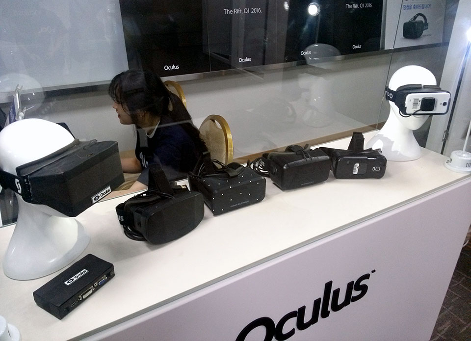

title: VR
importance: 9

----

# Virtual Reality

[L'Arrivée d'un train en gare de La Ciotat, 1895](http://en.wikipedia.org/wiki/L'Arrivée_d'un_train_en_gare_de_La_Ciotat) 

The train moving directly towards the camera was said to have terrified spectators at the first screening, a claim that has been called an urban legend. What most film histories leave out is that the Lumière Brothers were trying to achieve a 3D image even prior to this first-ever public exhibition of motion pictures, and later re-shot the film in stereoscopic 3D, first screened in 1935. Given the contradictory accounts that plague early cinema and pre-cinema accounts, it's plausible that early cinema historians conflated the audience reactions of the 2D and 3D screenings of L'Arrivée d'un Train. [Both 2D and 3D versions on vimeo](http://vimeo.com/55906895).

> "A new medium can suggest a multitude of approaches. In 1929, Dziga Vertov's *[The Man with the Movie Camera](https://www.youtube.com/watch?v=z97Pa0ICpn8)* catalogued possibilities for the evolution of film. From narrative structures to special effects, it shows *what cinema could have become*. Virtual reality occupies a similar historical moment--it is unformed and hence its possibilities seem unconstrained." 

> "Although the artistic community has often been excluded from the development of new technologies, this situation is changing. Artists no longer sit on the sidelines eventually to become grateful users of borrowed tools but have become active in development, creating a disturbance in the field with new contingencies... A new medium like Virtual Reality challenges traditional conventions not because the participant wears a helmet or glove but because it suggests new relationships between the viewer and the viewed... Unfortunately, as the medium of virtual environments becomes more and more defined, different approaches will be ignored, abandoned, or forgotten as the medium coalesces into a mature form."
> - *Douglas MacLeod, Director of the Banff Art and Virtual Environments Project*, in the preface of [Moser, Mary Anne, and Douglas MacLeod. Immersed in technology: art and virtual environments. MIT Press, 1996.](https://mitpress.mit.edu/books/immersed-technology), emphasis added.

The above citation neatly captures the aims of this course. In 2016, twenty years since this was written, and nearly fifty years since virtual reality's birth, it will finally become a widely-available consumer medium. Sony, Facebook, Google, Microsoft, Samsung, Valve, nVidia, Apple and many other large corporations are now gambling on VR's success. 

At a major computer graphics convention (SIGGRAPH) panel ([The Future is Here](http://www.hollywoodreporter.com/behind-screen/siggraph-oculus-rift-creator-says-724481)), drawing together many key figures from these tech giants in late 2014, the pivotal nature of the moment was utterly clear. Palmer Luckey, Oculus CEO: "I think it will be VR content and software that will drive the industry long term" - Palmer Luckey, Oculus CEO. AR pioneer Steven Feiner of Columbia University emphasized that "entertainment is the next big thing in VR." ... and that those who are starting to create VR content "will be so far ahead when the hardware is ready." ... Calling this time the "Wild West" for VR, senior director at the Sony Magic Lab, Richard Marks agreed, saying "there are no established genres. You don't get that opportunity very often." 

> "...in these early stages of the VR lifespan, a common mishap is occurring: content creators shoehorning old formats into new technologies. As we explore this new medium, we are building on the backs of film, theater, narrative games and visual art to takes cues as to what to create in VR." [Will Virtual Reality and 360° Film Experience an Industry Divide?](http://vrscout.com/news/virtual-reality-and-360-film/)

Instead of shoehorning, what can earlier developments of cinema, game, performance and visual (and sonic) arts tell us about the the explosion of virtual reality (VR) in our imminent future? Theories, methods, and unique modes of expression have yet to be established by the collision of gaming technology with cinema. As with any emerging medium, a willingness to break rules, abandon habits and re-learn is necessary. 

> "The future of VR lies in the unique experiences that get created in software, and if I knew what those would be, even in broad outline, I would be very happy." Michael Abrash, Chief Scientist, Oculus VR 

It is even obvious in the instability of terminology. Is it a game, a film, an experience, a simulation, a world, ...? Are we audience / viewer / visitor / cybernaut / immersant / player / user ...?

---

## What is VR

Film/animation depends on a perceptual illusion -- [persistence of vision](https://en.wikipedia.org/wiki/Persistence_of_vision). This is easier to understand via animation: around 12-15 frames per second is enough for the brain to interpret as movement, but only when sequent images are plausible enough to be fused. *Plausibility* in this case is a function of neurophysiology and cognition. (Of course, cinema also depends on other perceptual quirks, such as the brain's acceptance of cuts in editing even though nothing like a cut exists in real life, the suspension of disbelief through non-human perspectives, and so forth.)

Stereoscopic 3D (S3D) builds on another perceptual illusion. Presenting to each eye a viewpoint slightly displaced laterally emulates the *parallax effect* -- one of the most powerful visual cues to impart depth (distance). Again, this is dependent on the human body, and also requires very careful alignment. Some, though few, people experience discomfort due to discrepancies between the stereoscopic 3D depth cue and others that are lacking, such as vergence.

Virtual reality depends on both of these illusions, and others (such as egocentric spatialized audio). But where relatively low frame rates can satisfy on the projected screen, head-mounted VR depends on running at 60 or more frames per second (90 for the Oculus CV1), to avoid "judder". On the other hand, while the frame of S3D cinema causes inconsistencies (which is why *most* 3D effects do not pop out of the screen), in VR there is no such limitation, and objects can be as close as your nose.

The crucial addition for head-mounted VR is *head tracking*, which means we can present a coherent image regardless of what direction we face. This illusion breaks down if the delay between movement and image (motion-to-photon) is greater than a couple of handfuls of milliseconds, which underlies the need for high frame rates. This illusion is greatly enhanced by *position tracking*: matching the lateral movements of the head as well as its orientation, so that you can look around, over and under things, and generally benefit from more kinds of depth cues we experience in real life. The result is that the viewer no longer perceives an image plane worn in front of the eyes, and instead perceives oneself being present in another world. Instead of an image moving in front of your eyes, the world appears as a fixed space in which you are moving your own head. (Note that not all HMDs provide position tracking (e.g. Google Cardboard, Samsung VR). Together with the qualities of content, this leads to the evocation of *presence*, the sense of actually being-there in the world, sometimes referred to as the continuous illusion of non-mediation. 

---

## A bit of history

(See also [The Rise and Fall and Rise of Virtual Reality](http://www.theverge.com/a/virtual-reality/))

1838: Sir Charles Wheatstone invents [stereoscopic photography](https://www.youtube.com/watch?v=Pu6SOckMxT0&feature=youtu.be).

1968: Ivan Sutherland's Sword of Damocles, widely considered to be the first virtual reality (VR) and augmented reality (AR) head-mounted display (HMD) system. Ivan Sutherland, 1968, DARPA. Also read: [The Ultimate Display. Ivan E Sutherland, 1965](http://worrydream.com/refs/Sutherland%20-%20The%20Ultimate%20Display.pdf)

1985: VR at NASA:

<iframe width="480" height="360" src="https://www.youtube.com/embed/NAuytnYU6JQ?rel=0" frameborder="0" allowfullscreen></iframe>

### The 1990's rise

1991: ABC Primetime covers the VR scene (from [vrtifacts.com](http://vrtifacts.com/virtual-reality-1991-many-believe-it-will-revolutionize-the-way-we-live/))

<iframe width="480" height="360" src="https://www.youtube.com/embed/c5ZnWNilMxw?rel=0" frameborder="0" allowfullscreen></iframe>

1992: SIGGRAPH VR:

<iframe width="480" height="360" src="https://www.youtube.com/embed/S8pBnuB5rys?rel=0" frameborder="0" allowfullscreen></iframe>

1995: Char Davies' [Osmose](http://www.immersence.com/osmose/):

1995: Nintendo releases [VirtualBoy](https://en.wikipedia.org/wiki/Virtual_Boy) for US$ 180, and discontinues it just six months later. [("Nail in the coffin for 90's VR")](http://vrtifacts.com/virtual-boy-another-perspective/)

**What went wrong?**

1992 Merrill Lynch VR industry research report ["Limitations & Drawbacks"](http://www.vrtifacts.com/wp-content/uploads/2009/12/Merrill-Lynch-Limitations.pdf):
- Inadequate Image Resolution
- Time Lag Between the User and the System’s Response (now known as "motion to photon latency")
- Limited Position Tracking Systems
- Cumbersome Equipment
- Interpretation of Body Movements
- Total Representation of the Senses
- Simulation Sickness
- Cost Factors

According to [Jaron Lanier](http://www.jaronlanier.com/topeleven.html), reasons also included:
- Slow computers
- Poor software design
- Lack of data/understanding the human body, lack of haptics research etc.
- Premature launches & inflated expectations
- Charlatans
- Concern about liability (user accidents)
- Single-user problem
- No consumer "killer app"

See also: [Whatever happened to VR -- interview with Jaron Lainer](http://www.10zenmonkeys.com/2007/03/09/whatever-happened-to-virtual-reality/)

It is interesting to consider how many, and to what extent, these problems have been resolved today.

### The 2000's dip from public attention

For the next two decades, VR develops in research labs. Although VR failed as a 1990's consumer phenomenon, it was steadily successful and continued to grow in industrial, science & health research, as well as military training.

> "VR was used to visualize oil fields and to visualize machinery to extract oil more efficiently from old fields. Similar things happened in medicine. We understand more about large molecules, we understand more about how the body heals from surgery through VR simulations." - [Whatever happened to VR -- interview with Jaron Lainer (2007)](http://www.10zenmonkeys.com/2007/03/09/whatever-happened-to-virtual-reality/)

2003: [Second Life](http://secondlife.com) - "The largest-ever 3D virtual world created entirely by its users." [Wikipedia](https://en.wikipedia.org/wiki/Second_Life): In many ways, Second Life is similar to MMORPGs (Massively Multiplayer Online Role Playing Games); however, Linden Lab is emphatic that their creation is not a game... In May 2009, concurrent users averaged about 62,000.

Below is a promotional video, but there's all kinds of interesting subcultures in the brigther and darker sides of human nature evident in this world -- have fun googling. A great deal has been written about this world. Today both Linden Labs and founding CEO Philip Rosedale are at work creating similar worlds for HMD.

<iframe width="640" height="360" src="https://www.youtube.com/embed/B1Xxay54fYA?rel=0" frameborder="0" allowfullscreen></iframe>

But Lanier is still concerned -- now about a lack of creative imagination:

> "It's the same old stuff. There's no surprise. It's like ham radio or something. And that's been the worst problem for VR, because VR really needs a different attitude. Even today, you see people starting up a VR program and after some months they'll have a cube rotating or maybe a videogame where you're moving through a space and shooting at things. It's been done for decades! Do these people not know the meaning of boredom? How can people bear that?" - [Whatever happened to VR -- interview with Jaron Lainer (2007)](http://www.10zenmonkeys.com/2007/03/09/whatever-happened-to-virtual-reality/)

### The 2010's rise

Only with advances in GPU technology (largely driven by game industry) and portable displays (largely driven by smartphone industry) do devices such as the [Oculus Rift](oculus.html) become feasible.

2009: [The original BBS post in which Palmer Luckey announces his home-made Oculus "Rift" HMD.](http://www.mtbs3d.com/phpbb/viewtopic.php?f=120&t=14777)

2011: At the age of 18, Palmer hacks together a rough prototype in his parents’ garage in Long Beach, California.

2012: John Carmack (lead programmer of Doom, Quake, and many other pioneering 3D games) introduces a duct taped head-mounted display based on Luckey's prototype at the Electronic Entertainment Expo, which ran Carmack's own software. Palmer's company, Oculus VR, launches [a Kickstarter campaign](https://www.kickstarter.com/projects/1523379957/oculus-rift-step-into-the-game) to fund the development of the Rift. It is phenomenally successful from the start, finally raising US$2.4 million for the development of the Rift. This is the pivotal moment that attracts media attention to VR again.

2013: First Oculus Rift developer kit (DK1) ships, for $300. Developer kits are released to give developers a chance to develop content in time for the Rift's release; these have also been purchased by many virtual reality enthusiasts for general usage.

2014: Second Oculus Rift developer kit (DK2) ships, for $350. More than 100,000 DK2's have shipped by 2015. They are no longer in production.

Oculus VR is acquired by Facebook for $2 billion, which isn't well received by many of the original backers:

<iframe width="640" height="360" src="https://www.youtube.com/embed/C_JfB4YEan4?rel=0" frameborder="0" allowfullscreen></iframe>

2015: The Oculus/Samsung VR Gear (cellphone-based, no position tracking) is available to purchase.

2016: The first consumer Rift (AKA CV1) due to ship.

   
Image taken by author at the Unreal Summit, Seoul, May 2015.

---

So, are we in the beginning of the plateau of productivity, or in another hype cycle?

[For more on hype cycles](http://www.gartner.com/newsroom/id/2575515) -- Gartner in 2013 placed the plateau for VR in the 5-10 year range:

---

