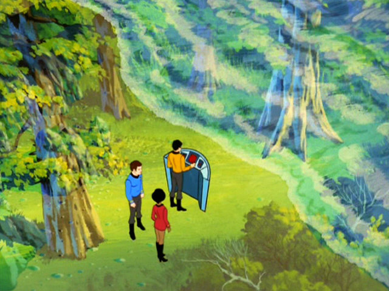

title: Virtual Reality
importance: 8

----

# Virtual Reality

- "An artificial world that consists of images and sounds created by a computer and affected by the actions of a person who is experiencing it." - Merriam-Webster
- "Computer technologies that use software to generate realistic images, sounds and other sensations that replicate a real environment (or create an imaginary setting), and simulate a user's physical presence in this environment, by enabling the user to interact with this space and any objects depicted therein using specialized display screens or projectors and other devices. " - Wikipedia

VR has also been defined as inducing targeted behaviour (such as having a designed experience) in an organism by using artificial sensory stimulation, while the organism has little or no awareness of the interference (LaValle 2016). The 'no awareness' condition has elsewhere been more eloquently articulated as **'the illusion of non-mediation'**. 

## What illusions?

- Film/animation depends on a perceptual illusion -- [persistence of vision](http://en.wikipedia.org/wiki/Persistence_of_vision). This is easier to understand via animation: around 12-15 frames per second is enough for the brain to interpret as movement, but only when sequent images are plausible enough to be fused. *Plausibility* in this case is a function of neurophysiology and cognition. (Of course, cinema also depends on other perceptual quirks, such as the brain's acceptance of cuts in editing even though nothing like a cut exists in real life, the suspension of disbelief through non-human perspectives, and so forth.)

- Stereoscopic 3D (S3D) builds on another perceptual illusion. Presenting to each eye a viewpoint slightly displaced laterally emulates the *parallax effect* -- one of the most powerful visual cues to impart depth (distance). Again, this is dependent on the human body, and also requires very careful alignment. Some, though few, people experience discomfort due to discrepancies between the stereoscopic 3D depth cue and others that are lacking, such as vergence.

Virtual reality depends on both of these illusions, and others such as egocentric spatialized audio, and greatly benefits from wide field of view, high resolution, and other factors of **immersion**. 

- The crucial addition for VR is *head tracking*, which means we can present a coherent image regardless of what direction we face. This illusion breaks down if the delay between movement and image (motion-to-photon) is greater than a couple of handfuls of milliseconds, which underlies the need for high frame rates (90fps for current desktop models) to avoid nauseating "judder". 

- This illusion is greatly enhanced by *position tracking*: matching the lateral movements of the head as well as its orientation, so that you can look around, over and under things, and generally benefit from more kinds of depth cues we experience in real life, as well as further reducing the chance of nausea.

The result is that the viewer no longer perceives an image plane worn in front of the eyes, and instead perceives oneself being present in another world. Instead of an image moving in front of your eyes, the world appears as a fixed space in which you are moving your own head. (This also means that stereoscopic content can be as close as your nose, something that S3D cinema cannot normally achieve because of the limits of the frame).

- The combination of all the above can create a compelling immersive experience. Instead of an image moving in front of your eyes, the world appears as a fixed space in which you are moving your own head. Together with the qualities of content, this leads to the evocation of **presence**, the sense of actually being-there in the world; a continuous illusion of non-mediation. 

- But aside from presence, VR also maximizes interaction (the extent to which a user can manipulate objects and the environment of the system) and autonomy (the system's ability to receive and react to external stimuli, such as actions performed by a user). In that regard, convincing experiences created by **real-time simulations that support agency** -- the ability to take meaningful action in a world and discover meaningful consequences -- are just as essential.

---

## A brief history of VR

30,000 BCE-: From the firelit cave paintings of Lascaux to the birth of painting, architecture, and other arts, we have been attempting to recreate both the world around us and our imagination within.

4thC BCE: Zhuangzi dreams he is a butterfly, but questions if he is a butterfly dreaming he is a man. Are dreams also simulations? 

> Once Zhuang Zhou dreamed he was a butterfly, a fluttering butterfly. What fun he had, doing as he pleased! He did not know he was Zhou. Suddenly he woke up and found himself to be Zhou. He did not know whether Zhou had dreamed he was a butterfly or a butterfly had dreamed he was Zhou. Between Zhou and the butterfly there must be some distinction. This is what is meant by the transformation of things.
> During our dreams we do not know we are dreaming. We may even dream of interpreting a dream. Only on waking do we know it was a dream. Only after the great awakening will we realize that this is the great dream.

~380 BCE: Plato likens the uneducated to prisoners in a cave unable to turn their heads. A fire behind them casts shadows of puppets, also behind them, such that all they can see are the puppets' shadows on the wall in front. Such prisoners mistake appearance for reality. (The allegory is intended to show that the names we give for things, to allow us as prisoners to converse about what we see, are in fact names for things that we cannot see, but only grasp with the mind. That is, the real meaning of the words we use is not something that we can ever see with our senses alone. But we can only know this by being liberated from the illusion of the shadows.)

1637-1672: René Descartes invents conventions for analytic geometry and algebraic approaches to geometry; for which reason we still describe space in X, Y and Z axes and call this "Cartesian" coordinates. He believed that algebra was a method to automate reasoning. 

Descartes also uses methodological skepticism to question his existence and perception, and whether he is dreaming or things are externally real. Influenced by the mechanical automatons of his time, he draws attention to the problem of the connection between body and mind, inadvertently launching a dualism that dominates Western thought thenceforth and remains an influence over and problem of VR. 

> "VR opens the door to what Jaron Lanier (who coined the term virtual reality in the 1980s) calls “post-symbolic communication”: No longer are we limited to communicating via sequences of symbols represented by audible vibrations of our vocal chords, or produced by our fingers pressing on a series of keys or, more recently, a flat piece of glass. Instead, you experience my dream directly, without having to interpret long strings of verbal or written symbols... The medium, the place where those stories will unfold, exists within our consciousness. We’ll find ourselves having passed through our long-held, precious frames to live within those stories. And we’ll carry the memory of those stories not as content that we once consumed, but as times and spaces we existed within." - [source](http://virtualrealitypop.com/futureofvr-8be30f0fca6a#.n1s3d4n92)

1800's: The popular wave of massive-scale panorama paintings, often with dedicated buildings, usually depicting landscapes and/or historic events. 

At the same time, the first attempts to capture permanent images from camera obscura (themselves inspired by caves...) through chemical means marks the birth of photography.

1838: Sir Charles Wheatstone invents [stereoscopic photography](http://www.youtube.com/watch?v=Pu6SOckMxT0&feature=youtu.be).

1885/1935: L'Arrivée d'un Train 

<iframe src="http://player.vimeo.com/video/55906895" width="640" height="360" frameborder="0" webkitallowfullscreen mozallowfullscreen allowfullscreen></iframe>

The train moving directly towards the camera, shot in 1895, was said to have terrified spectators at the first screening, a claim that has been called an urban legend. What most film histories leave out is that the Lumière Brothers were trying to achieve a 3D image even prior to this first-ever public exhibition of motion pictures, and later re-shot the film in stereoscopic 3D, first screened in 1935. Given the contradictory accounts that plague early cinema and pre-cinema accounts, it's plausible that early cinema historians conflated the audience reactions of the 2D and 3D screenings of L'Arrivée d'un Train.

1901: L. Frank Baum, an author, first mentions the idea of an electronic display/spectacles that overlays data onto real life (in this case 'people'), it is named a 'character marker'.

1935: Stanley G. Weinbaum's short story "Pygmalion's Spectacles" describes a goggle-based virtual reality system with holographic recording of fictional experiences, including smell and touch: "You are in the story, you speak to the shadows (characters) and they reply, and instead of being on a screen, the story is all about you, and you are in it."

1939: The ViewMaster stereoscopic device is launched.

1943: Patent filed for a head-mounted stereo TV.

1929-1950s: Link Trainer, a mechanical flight simulator with motion simulation, used by over 500,000 pilots.

1950s-60s: The "golden era" of 3D cinema. 

1957–62: Morton Heilig, a cinematographer, creates and patents a mechanical simulator called Sensorama with visuals, sound, vibration, and smell. Heilig later (1960) filed a patent for a multisensory HMD.

> "When anything new comes along, everyone, like a child discovering the world, thinks that they've invented it, but you scratch a little and you find a caveman scratching on a wall is creating virtual reality in a sense." - Morton Heilig

1961: Philco Headsight is the first HMD, used for remote camera viewing (CCTV), including head orientation tracking.

1963: Ivan Sutherland's Sketchpad, one of the first interactive graphics program.

<iframe width="640" height="360" src="http://www.youtube.com/embed/USyoT_Ha_bA?rel=0" frameborder="0" allowfullscreen></iframe>

   
Hugo Gernsback (of "Hugo Awards" fame), wearing his TV Glasses in a 1963 Life magazine shoot.

1964: New York inventor and holographer Gene Dolgoff, who is also the inventor of the digital projector, creates a holography laboratory. Dolgoff's obsession with holography included theories of "matter holograms", the holographic nature of the universe, and the holographic nature of the human brain. 

1965: Ivan Sutherland pens [The Ultimate Display. Ivan E Sutherland, 1965](http://worrydream.com/refs/Sutherland%20-%20The%20Ultimate%20Display.pdf), inspiring everything from the Holodeck to the Matrix. 

> "The ultimate display would, of course, be a room within which the computer can control the existence of matter. A chair displayed in such a room would be good enough to sit in. Handcuffs displayed in such a room would be confining, and a bullet displayed in such a room would be fatal. With appropriate programming such a display could literally be the Wonderland into which Alice walked."

1968: Ivan Sutherland's Sword of Damocles, widely considered to be the first virtual reality (VR) and augmented reality (AR) head-mounted display (HMD) system. DARPA. 

<iframe width="640" height="360" src="http://www.youtube.com/embed/NtwZXGprxag?rel=0" frameborder="0" allowfullscreen></iframe>

The next twenty years see slow but non-stop development of VR technologies largely within military, industry, and science research institutions, with a slow infiltration into popular culture.

1974: The Holodeck concept appears in Star Trek: the Animated Series, and reappears in 1987 in Star Trek: The Next Generation.

1975: Myron Krueger creates Videoplace to allow users to interact with virtual objects for the first time. Book "Artificial Reality" articulates an artform whose primary material is real-time interaction itself.

<iframe width="640" height="360" src="http://www.youtube.com/embed/dmmxVA5xhuo?rel=0" frameborder="0" allowfullscreen></iframe>

1977: Star Wars features a hologram (Leia's message for Kenobi) and some of the first widely-seen 3D computer graphics in film (the Death Star plans).

1978: [Aspen Movie Map](http://en.wikipedia.org/wiki/Aspen_Movie_Map) -- a proto Streetview, interactive via laserdisc, that also had a polygonal mode.

<iframe width="640" height="360" src="http://www.youtube.com/embed/2Ytd12d6qNw?rel=0" frameborder="0" allowfullscreen></iframe>

1979: LEEP HMD with lenses designed for very wide field of view.

1980: Steve Mann creates the first wearable computer, a computer vision system with text and graphical overlays on a photographically mediated reality.

Battlezone is the first big 3D vector graphics success in arcade games. Battlezone was thought so realistic that the US Army used it to train tank gunners.

1982: Atari founds a VR research lab

[Tron](http://en.wikipedia.org/wiki/Tron) movie

1983: Brainstorm movie.

1984: William Gibson writes [Neuromancer](http://en.wikipedia.org/wiki/Neuromancer), bringing wide acclaim to the cyberpunk genre.

Elite, an open world space trading video game, published by Acornsoft for the BBC Micro and Acorn Electron computers, featuring revolutionary 3D graphics

1985: Jaron Lanier (formerly of the Atari lab) coins the phrase Virtual Reality and creates the first commercial business ("VPL") around virtual worlds.

VR at NASA:

<iframe width="480" height="360" src="http://www.youtube.com/embed/NAuytnYU6JQ?rel=0" frameborder="0" allowfullscreen></iframe>

1988: The Legible City. Jeffrey Shaw

<iframe width="720" height="540" src="http://www.youtube.com/embed/61l7Y4MS4aU?rel=0" frameborder="0" allowfullscreen></iframe>

[See documentation here](http://www.jeffrey-shaw.net/html_main/show_work.php?record_id=83)

- Conceived as a break from cinema, in which the image is directed by the viewer (cyclist). 
- Drift / derive

1989: [Shadowrun](http://en.wikipedia.org/wiki/Shadowrun) desktop role-playing game in a near-future cyberpunk + VR world

The 90's saw a wave of public interest and hype in VR, which as it grew became often conflated with cybernetics, AI, computer graphics in general, the nascent internet, etc. as *cyberspace*.

1991: Virtuality company launches with a new multiplayer hardware prototype in several countries -- but at $73,000 per unit! Sega also launches a VR headset for their console.

EVL in Chicago launches the first cubic CAVE VR system. Later commercialized by Mechdyne, WorldViz and others, still actively installing new systems in research labs around the world today.

Retinal display developed, scanning images onto retina, commercialized by Microvision. (Antecedent of tomorrow's MagicLeap).

Computer Gaming World magazine predicted "Affordable VR by 1994"

ABC Primetime covers the VR scene (from [vrtifacts.com](http://vrtifacts.com/virtual-reality-1991-many-believe-it-will-revolutionize-the-way-we-live/)):

<iframe width="480" height="360" src="http://www.youtube.com/embed/c5ZnWNilMxw?rel=0" frameborder="0" allowfullscreen></iframe>

1992: Neal Stephenson writes [Snow Crash](http://en.wikipedia.org/wiki/Snow_Crash)

Lawnmower Man movie.

Sega Virtua Racing, and Virtua Fighter (1993) popularized polygonal 3D games.

1994: The first version of Virtual Reality Modeling Language (VRML), a standard for sharing interactive  3D vector graphics on the web, and by 1997 several 3D chat environments exist.

1995: Maurice Benayoun creates a VR artwork **Tunnel under the Atlantic** connecting the Pompidou Centre in Paris and the Museum of Contemporary Art in Montreal with 3D modeling, video chat, spatialized sound, and AI.

Strange Days and Johnny Mnemonic movies.

Char Davies creates [Osmose](http://www.immersence.com/osmose/), a pinnacle of VR art.

- Char Davies was painter, and became a co-founder of SoftImage (later Autodesk)
- Wanted to **demonstrate medium's potential**, and "aspects related to the medium of "virtual reality" that are often overlooked"

---

However, the same year was also identified as the 'death of VR'. Nintendo releases [VirtualBoy](http://en.wikipedia.org/wiki/Virtual_Boy) for US$ 180, and discontinues it just six months later. [("Nail in the coffin for 90's VR")](http://vrtifacts.com/virtual-boy-another-perspective/) A survey by Computerworld magazine in 2007 listed VR as the 7th biggest technology flop in history.

**What went wrong?**

- Inadequate Image Resolution
- "Motion to photon latency" too high
- Limited Position Tracking
- Cumbersome Equipment
- Lack of Interpretation of Body Movements
- Simulation Sickness
- Cost
- Slow computers
- Poor software design
- Lack of data/understanding the human body, lack of haptics research etc.
- Premature launches & inflated expectations
- Charlatans
- Concern about liability (user accidents)
- Single-user problem
- No consumer "killer app"

 

1996: Quake pioneers play over the Internet first-person shooters. 

3dfx Interactive released the Voodoo chipset, leading to the first affordable 3D accelerator cards for personal computers. [Within a few years dedicated 3D graphics processing unit cards (GPUs) become essential for most video games, and GPU performance wars rapidly increase real-time 3D rendering capabilities at consumer price levels.](http://www.techradar.com/news/gaming/the-evolution-of-3d-games-700995/2)

Meanwhile, although VR was still capturing some SF attention and slowly being rediscovered through the web, VR develops mainly in research labs, and steadily continues to grow in big-budget industrial, science & health research, as well as military training, outside the media radar.

> "VR was used to visualize oil fields and to visualize machinery to extract oil more efficiently from old fields. Similar things happened in medicine. We understand more about large molecules, we understand more about how the body heals from surgery through VR simulations." - [Whatever happened to VR -- interview with Jaron Lainer (2007)](http://www.10zenmonkeys.com/2007/03/09/whatever-happened-to-virtual-reality/)

1999: [The Matrix](http://en.wikipedia.org/wiki/The_Matrix) movie, and eXistenZ.

2001: Grand Theft Auto III released, popularizing open world games with a non-linear style of gameplay

2005: [The AlloSphere](http://www.allosphere.ucsb.edu)

<iframe width="640" height="360" src="https://www.youtube.com/embed/u-D-zEToJQ4?rel=0" frameborder="0" allowfullscreen></iframe>

Over this period it also gradually begins to appear on the web.

1999: Entrepreneur Philip Rosedale forms Linden Lab to develop hardware for 360 degree VR, but this soon transforms into a platform for 3D socializing, launching SecondLife in 2003.

2007: Google Streetview launched.

**VR goes into the garage, then goes mainstream again**

2009: [A teenage Palmer Luckey announces on a BBS post his home-made Oculus "Rift" HMD.](http://www.mtbs3d.com/phpbb/viewtopic.php?f=120&t=14777)

2011: Now 18, Palmer hacks together a rough prototype in his parents’ garage in Long Beach, California.

2012: John Carmack (lead programmer of Doom, Quake, and many other pioneering 3D games) introduces a duct taped head-mounted display based on Luckey's prototype at the Electronic Entertainment Expo. Palmer's company, Oculus VR, launches [a Kickstarter campaign](http://www.kickstarter.com/projects/1523379957/oculus-rift-step-into-the-game) to fund the development of the Rift. It is phenomenally successful,  raising US$2.4 million for the development of the Rift. 

<iframe width="640" height="360" src="http://www.youtube.com/embed/DhcOMOWRMnA?rel=0" frameborder="0" allowfullscreen></iframe>

2013: First Oculus Rift developer kit (DK1) ships, for $300. Developer kits are released to give developers a chance to develop content in time for the Rift's release; these have also been purchased by many virtual reality enthusiasts for general usage.

2013: Google announces an open beta test of its Google Glass augmented reality glasses.

2014: Second Oculus Rift developer kit (DK2) ships, for $350. More than 100,000 DK2's shipped by 2015. Oculus VR is acquired by Facebook for $2 billion.

2015: Microsoft announces HoloLens augmented reality headset.

HTC partners with Valve Corporation to develop the HTC Vive headset and controllers, released early 2016.

---

2016: "the year of VR"

- Sony, Facebook, Google, Microsoft, Samsung, Valve, nVidia, Apple and many other large corporations gambling on VR's success. 
- Why now?
	- Technological feasibility & affordability
		- Advances in small displays (thanks to cellphone industry)
		- Advances in 3D graphics (thanks to gaming industry)
	- Gaming industry crisis? Looking for the next big thing?
- Slow rise/uptake. Still not exactly cheap!
- 360 video vs. "real" VR (becoming a polemic)
- Seated vs. room-scale VR (perhaps more temporary)
- SteamVR vs. Oculus Home vs. Viveport (content delivery networks)

Hardware:
- Two consumer PC-tethered headsets (Oculus Rift, HTC Vive) 
	- started shipping in May, hit major stores by summer.
	- currently tethered to PC by cable, but untethered expected to come
- One console-based headset (Playstation VR)
- Several cellphone-based devices 
	- Better quality: GearVR
	- More budget: Google Cardboard, Daydream
	- lower resolution/FPS, but $99 or less + phone
	- position tracking developing
- Lots of other variants and upcoming devices, e.g. OSVR
	
**Rift | Vive + PC specs**

- **Resolution**: 2160 x 1200
- **Refresh rate**: 90 fps
- **Field of view**: 110 degrees
- **Tracking area**: 5 x 11 feet | 15 x 15 feet
- **Video**: no input | front-facing camera
- **Audio**: mic + headphones | mic + headphone jack
- **Price**: ~USD$800 including hand controllers

But that price doesn't include the PC... add another $2000 or so for:

- **GPU:** NVIDIA GTX 970 / AMD R9 290 equivalent or greater
- **CPU:** Intel i5-4590 / AMD FX 8350 equivalent or greater
- **Memory:** 8GB+ RAM
- **Video Output:** HDMI 1.4 or DisplayPort 1.2 or newer
- **USB:** 3x USB 3.0 ports plus 1x USB 2.0 port
- **OS:** Windows 7 SP1 64 bit or newer

2017 onward:

Untethered HMDs and improved display, hand-tracking, eye-tracking, etc.

It's not 1995 -- there's huge investment, affordable platforms, ready authoring tools and delivery networks, and proven use cases. 

[VR and AR are the next mega tech themes through to 2030; with today likened to the state of mobile phones 15 years ago. Major mainstream adoption predicted for 2025. VR will be the first phase, followed by AR. Content market expected to reach $5.4B by 2025.](http://cdn.instantmagazine.com/upload/4666/piperjaffray.f032beb9cb15.pdf)

Soon-to-emerge tech in AR: Microsoft HoloLens, Meta, Magic Leap (massive investments), Tango, etc.

[Augmented/Virtual Reality revenue forecast revised to hit $120 billion by 2020](http://www.digi-capital.com/news/2016/01/augmentedvirtual-reality-revenue-forecast-revised-to-hit-120-billion-by-2020/#.WBCt8Fdy7y8)

- Are we in the beginning of the plateau of productivity, or in another hype cycle? [For more on hype cycles](http://www.gartner.com/newsroom/id/2575515) -- Gartner in 2013 placed the plateau for VR in the 5-10 year range.

> (See also [The Rise and Fall and Rise of Virtual Reality](http://www.theverge.com/a/virtual-reality/) and [Introduction to Virtual Reality](http://www.slideshare.net/marknb00/comp-4010-lecture-1-introduction-to-virtual-reality))

## The message of the medium

VR and AR expected to disrupt not only games and film, but also music, advertising, social media, education, travel, and who knows what else (maybe Black Mirror does). But do we know what we are doing?

> Palmer Luckey, Oculus CEO: "I think it will be VR content and software that will drive the industry long term". 

> Richard Marks, Sony Magic Lab: "Wild West... there are no established genres. You don't get that opportunity very often." 

> Michael Abrash, Chief Scientist, Oculus: "The future of VR lies in the unique experiences that get created in software, and if I knew what those would be, even in broad outline, I would be very happy." 

It is even obvious in the instability of terminology. Is it a game, a film, an experience, a simulation, a world, ...? Are we audience / viewer / visitor / cybernaut / immersant / player / user ...?

---

> "A new medium can suggest a multitude of approaches. In 1929, Dziga Vertov's [The Man with the Movie Camera](http://www.youtube.com/watch?v=z97Pa0ICpn8) catalogued possibilities for the evolution of film. From narrative structures to special effects, it shows *what cinema could have become*. Virtual reality occupies a similar historical moment--it is unformed and hence its possibilities seem unconstrained."

> "Although the artistic community has often been excluded from the development of new technologies, this situation is changing. Artists no longer sit on the sidelines eventually to become grateful users of borrowed tools but have become active in development, creating a disturbance in the field with new contingencies... A new medium like Virtual Reality challenges traditional conventions not because the participant wears a helmet or glove but because it suggests new relationships between the viewer and the viewed... Unfortunately, as the medium of virtual environments becomes more and more defined, different approaches will be ignored, abandoned, or forgotten as the medium coalesces into a mature form." - Douglas MacLeod, Director of the Banff Art and Virtual Environments Project, in the preface of Moser, Mary Anne, and Douglas MacLeod. [Immersed in technology: art and virtual environments. MIT Press, 1996.](http://mitpress.mit.edu/books/immersed-technology), emphasis added.

The above citation neatly captures the aims of this course. In 2016, twenty years since this was written, and nearly fifty years since virtual reality's birth, it is finally becoming a widely-available consumer medium. 

> "...in these early stages of the VR lifespan, a common mishap is occurring: content creators shoehorning old formats into new technologies. As we explore this new medium, we are building on the backs of film, theater, narrative games and visual art to takes cues as to what to create in VR." [Will Virtual Reality and 360° Film Experience an Industry Divide?](http://vrscout.com/news/virtual-reality-and-360-film/)

Instead of shoehorning, what can earlier developments of cinema, game, performance and visual (and sonic) arts tell us about the the explosion of virtual reality (VR) in our imminent future? Theories, methods, and unique modes of expression have yet to be established by the collision of gaming technology with cinema. As with any emerging medium, a willingness to break rules, abandon habits and re-learn is necessary.

> "Hayao Miyazaki is [quoted](https://youtu.be/jtTBYMvLBbw) as making the following observation: "[anime] is produced by humans who can't stand looking at other humans.” I am proposing that this observation is not limited to anime. Much of what our culture makes seems to be made against, rather than for, other humans. Cities made for cars and rent extraction are simply a very large, indeed inescapable symptom of the and disease. We could say the same for industrialized art and music and nearly every globalized thing we come into contact with. The issue ... is the difference between the imagined, idealized vision, and its eventual commodification. For a brief moment, each new technology opens a space of freedom and opportunity. It is easy to mistake this space for something permanent. In reality, it is just the wave receding before the next tsunami. Whatever freedom can exist will have to be found on a different shore. For the creative person, this is adventure and excitement and possibility. But for everyone else, the tsunami can be devastating." - Marcos Novak

