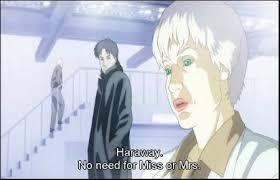
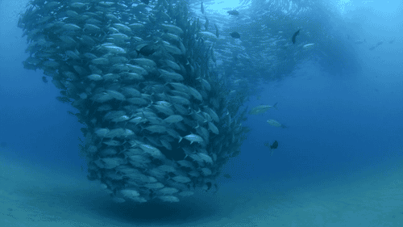

title: CTVA
importance: 10

----

# Contemporary Theory and the Visual Arts

**Course:** VISA 5600   
<!--**Class/lab time:** Monday 10:00am - 1:00pm   
**Location:** 309 GCFA
-->
**Course director:** Graham Wakefield   
**Office:** 303C GCFA    
**Email:** grrrwaaa at yorku dot ca  

[OFFICIAL YORK OUTLINE HERE](http://xenopraxis.net/readings/5600_13.pdf)

This graduate seminar is intended as an intensive investigation of current (and historical) theoretical perspectives as they might productively intersect with art practice, at large. The overriding impulse is essentially speculative, geared towards uncovering blindspots within which new forms of praxis can be envisioned. 

<!-- Given the appropriation of the avant-garde by the military-industrial-corporate complex—who has long understood and readily exploited the potential for sensory redistribution which to a large extent determines what is thinkable, perceptible—it is urgent for artists not only to gain a firm grasp on the specific modalities by which power operates, but also to develop speculative practices as “positive feedback”, essential to ejecting from increasingly tight communication and control. Consequently, much of this course will be devoted to directly engaging with the idea of the FUTURE, which has suffered greatly in light of the so-called “end of history”.-->

Each week, one or two students will be responsible for leading discussion around assigned readings.  Each student will devote sufficient time to unraveling their various complexities with an eye on developing productive questions to animate group encounters. 

A healthy conversation requires rigour as well as open-ness. A willingness to give as much as is taken, suspending the habitual to become immersed in the unfamiliar, and to imagine it further. We don't get into "the zone" of flow by becoming comfortable, we don't make discoveries by prescribing what we want. Thus the materials we look at won't necessarily spring from the art world and its imperatives, even if most come from fields and lines of inquiry of inspirational or influential relation to it. Mapping materials from alien fields into art practice may open up more interesting lines of speculation than theory that already takes for granted the parameters of art. And true to the spirit of adaptation, the readings assigned will develop along with our discussions in a feedback loop. Likewise, any new resonances in praxis or of alternate non-textual nature are also most welcome to the conversation! No matter how deep or far we roam however, the first and last priorities are our own practice. 

**Grading breakdown**

- In-class presentations: 50%
- Final Symposium Presentation: 25%
- Final Written Document: 25%

The final project will consist in a 30-minute presentation, functioning at once as a speculative proposal for a future art project while being grounded in at least two of the assigned readings (and attendant associations which these will inevitably entail). Given that this project does not require (immediate) actualization, speculation can be allowed a wide berth.

<!--These presentations will take place on a day-long Symposium on Art and Speculation (provisional title), which will be open to the public.-->

This presentation will be distilled into a 5000 (PhD) or 3500-word (MA/MFA) written document to be handed in one week after the public presentation. Documents received later than the due date will be penalized three grade points per day that assignment is late. Exceptions to the lateness penalty for valid reasons such as illness, compassionate grounds, etc., may be entertained by the Course Instructor but will require supporting documentation (e.g., a doctor’s letter).

----------------------------

> "No matter how alienated we become, we produce patterns that mirror the natural world"--Victoria Vesna

> "For the first time the word organic ceases to be an unobtainable ideal held out to the artist; following in the wake of cybernetic technology, systems with organic properties will lead to "sculpture" - if it can be called that - rivaling the attributes of intelligent life [2]." --Jack Burnham, Beyond Modern Sculpture: The Effects of Science and Technology on the Sculpture of This Century (New York: George Braziller, 1968),

## Life as it could be

The seed for the conversations of CTVA this year is "life as it could be". Here life is understood both in the sense of the living environment–the world in which we live–as well as the predominantly biological phenomenon of which humans are one example. The phrase "life as it could be" became a mantra for researchers in the field of Artificial Life, a field named in the 80's but with a longer heritage deeply enmeshed with Cybernetics, and which has likewise today vanished from the public eye to the extent that it has become integral to so many media and fields surrounding us, from deep learning AI to new biomaterials. And for that matter, the current resurgence of virtual reality, frequently forgetful of its visitation two decades ago, so deeply tied into a speculative cyber-culture that is also now ingrained into our theory furniture. A working hypothesis we begin from therefore is a continuum or flat ontology of life and technology as environmental media, the dual sense of media as natural and artificial, elemental and signifying, regardless our preferences. Nature is our oldest and newest inspiration. What is the role of art in a future increasingly saturated in interconnected technology and computational media, at scales far above and below the human? How will established roles adapt or otherwise respond to the world we are creating for ourselves? What new forms, concepts, methods, and critiques emerge? What blindspots or all-too-human limitations can artists reveal? Most of all, how does this reality making itself, within a world unmaking itself, inform your practice?

**Week 1 (Sep 11):**

- Brief summary of class structure/content
- Introductions 
- Presentation

**Week 2 (Sep 18):** 

Readings: The first set begin in the earth, roaming far and wide:

- John Durham Peters. Understanding Media. In The Marvelous Clouds: Toward a philosophy of elemental media. University of Chicago Press, 2015. *Led by Laurie-Lynn.*
- Manuel Delanda. Nonorganic Life. In Incorporations. New York: Zone Books 29 (1992). *Led by Miles*

**Week 3 (Sep 25):** 

Readings: Turtles all the way around (Cybernetics)

- Johnston, John. The allure of machinic life: cybernetics, artificial life, and the new AI. MIT Press, 2008. *Led by Shaughna*
- Papert, Seymour. Mindstorms: Children, computers, and powerful ideas. Basic Books, Inc., 1980. *Led by Zhaoyue*
- Braitenberg, Valentino. Vehicles: Experiments in synthetic psychology. MIT press, 1986. *Led by Katika*

**Week 4 (Oct 2):** 

- Announcement: [CVR Talk, Friday.](https://calendar.google.com/calendar/render?eid=XzZsMGthYzlpOG9wNDRiOWc2OHBqMGI5azhjcTQyYmExNmgzMzRiOWw2aDIzaWdwbzYwcGowZTFsNmcgY3ZyLnNlbWluYXJzQG0&ctz=America/Toronto&sf=true&output=xml#eventpage_6) (How scientists observe how artists observe how people observe...)

- Taking stock.

Readings: Umwelten

- Jakob von Uexküll. A Foray Into the Worlds of Animals and Humans: With a Theory of Meaning. Springer, 1934. *Led by Naz*
- Rodney Brooks. What Is It Like to Be a Robot? [online](https://rodneybrooks.com/what-is-it-like-to-be-a-robot/), 2017. *Led by Monica*
- Brian Massumi. Strange Horizons. In Parables for the Virtual. Duke University Press, 2002. *Led by Linda*

(Oct 9: University Closed)

**Week 6 (Oct 23):** 

Readings: Are we there yet? Cybervisions from artists in the first wave of VR.

- Marcos Novak. Liquid Architectures in Cyberspace. In Cyberspace: First Steps, ed. M Benedikt. 1991. 
	- And: [Transmitting architecture: the transphysical city](http://www.ctheory.net/articles.aspx?id=76). CTheory.net. 1996. 
	- *Led by Ilze*

- Simon Penny. ["Virtual Reality as the End of the Enlightenment Project"](http://simonpenny.net/texts/enlightenment.html) In Culture on the Brink: the Ideologies of Technology. Virtual Reality Casebook, Eds Anderson and Loeffler, Van Nostrand, 1994. *Led by Miles*

- Char Davies. [Virtual Space.](http://www.immersence.com/publications/char/2004-CD-Space.html) In “Space: In Science, Art and Society”, François Penz, Gregory Radick and Robert Howell, eds. Cambridge University Press. 2004.
	- And: [Rethinking VR: Key Concepts and Concerns.](http://www.immersence.com/publications/char/2003-CD-VSSM.html) In Hybrid Reality: Art, Technology and the Human Factor
Hal Thwaites, ed. International Society on Virtual Systems and Multimedia. 2003.
	- *Led by Ester*

[Look here](https://www.dropbox.com/sh/wmrop5yicmbb82w/AAAjX7i9AMeLoCOFUswkd_WNa?dl=0)

**Week 7 (Oct 30):** 

- Donna Haraway: The Cyborg Manifesto (1985). *Led by Linda*

- Donna Haraway: The Companion Species Manifesto (2003). *Led by Katika*

**Week 8 (Nov 6):** 

Games of Simulation

- Games & manifestoes:
	- [Zimmerman, Eric, and Heather Chaplin. "Manifesto: The 21st century will be defined by games." Kotaku.com (2013).](https://kotaku.com/manifesto-the-21st-century-will-be-defined-by-games-1275355204) 
		- Extra credit: [Some responses](https://kotaku.com/will-the-21st-century-be-defined-by-games-1293867009)
	- [Harvey, Auriea, and Michaël Samyn. "Realtime art manifesto." Gaming realities: the challenge of digital culture, mediaterra festival of Art and Technology, Athens (2006).](http://tale-of-tales.com/tales/RAM.html)

- Whitelaw, Mitchell. "System stories and model worlds: A critical approach to generative art." Readme 100 (2005): 135-154.
	- and Whitelaw, Mitchell, Mark Guglielmetti, and Troy Innocent. "Strange ontologies in digital culture." Computers in Entertainment (CIE) 7.1 (2009): 4.

- [Bogost, Ian.](http://bogost.com) [Unit operations: An approach to videogame criticism. MIT press, 2008.](http://bogost.com/books/unit_operations/) 
	- Chapter 2: Structuralism & Computation
	- Chapter 7: Cellular Automata & Simulation

**Week 9 (Nov 13):** 

Games of Simulation and Society

- Rogers, Kenneth. The Attention Complex: Media, Archeology, Method. Springer, 2014.
	- Last chapter: Game of Life.

- [Chip Morningstar and F. Randall Farmer. Lessons from Lucasfilm’s Habitat. The First International Conference on Cyberspace, 1990.](http://www.fudco.com/chip/lessons.html)

- Paolo Pedercini (
[Molleindustria](http://www.molleindustria.org)). [SimCities and SimCrises. International City Gaming Conference, Rotterdam, 2017](http://molleindustria.org/GamesForCities/)

**Week 10 (Nov 20):** 

**Week 11 (Nov 27):** 

**Week 12 (Dec 4):** 

- Final Presentations

----

<iframe width="720" height="540" src="https://www.youtube.com/embed/lLULRlmXkKo?rel=0" frameborder="0" allowfullscreen></iframe>

[Logo in the browser](http://www.calormen.com/jslogo/)

See the Pen <a href="https://codepen.io/grrrwaaa/pen/RLoaaP/">Agent-environment: 4 kinds of two eye vehicles</a> by Graham (<a href="https://codepen.io/grrrwaaa">@grrrwaaa</a>) on <a href="https://codepen.io">CodePen</a>.

Casey Reas (co-author of the Processing creative coding environment), and many others, have used populations of Braitenberg-inspired vehicles to create artworks based on their combined paths.

<iframe width="560" height="315" src="https://www.youtube.com/embed/HdJk8ROpuEo" frameborder="0" allowfullscreen></iframe>

<iframe src="https://player.vimeo.com/video/196269431" width="640" height="360" frameborder="0" webkitallowfullscreen mozallowfullscreen allowfullscreen></iframe>

---

Char Davies' *Osmose*, exhibited (and recorded) at Musee d'Art Contemparain de Montreal:

<iframe width="640" height="480" src="http://www.youtube.com/embed/54O4VP3tCoY?rel=0" frameborder="0" allowfullscreen></iframe>

[A mini documentary](http://youtu.be/bsT59fp8LpY)

Ephemere, 1998:

<iframe width="640" height="480" src="https://www.youtube.com/embed/XCWaMll0leI?rel=0" frameborder="0" allowfullscreen></iframe>

---

<!--

<iframe width="640" height="360" src="https://www.youtube.com/embed/QOCaacO8wus?rel=0" frameborder="0" allowfullscreen></iframe>

[The WaitButWhy follow-up](http://waitbutwhy.com/2014/12/what-makes-you-you.html?doing_wp_cron=1418415874.1286160945892333984375)

Living Architectures

The research area of *living architecture* is predicated around the question of whether our lived environment can integrate living or near-living functions. This question has attracted quite significant support. Primarily based in Ontario, the [Living Architecture Systems Group (LASG)](http://livingarchitecturesystems.com), led by architect and artist Philip Beesley, received a 6-year, $2.5m Partnership grant from the Social Sciences and Humanities Research Council. York is among its partners, along with many national and international researchers, designers, and artists. In Europe, LASG parter Rachel Armstrong's own Living Architecture research project received [€3.2m of funding](https://www.interaliamag.org/interviews/rachel-armstrong-living-architecture/) from the European Union’s Horizon 2020 Research and Innovation Programme. 

As a playful counterfoil to the position papers by these two immense figures, let's also look at a very short but provocative Artforum column by Vilém Flusser. Flusser was a philosopher and journalist shaped by Heideggerian existential phenomenology who later focused on the philosophy of communication and art practice, particularly photography.

-->

 

